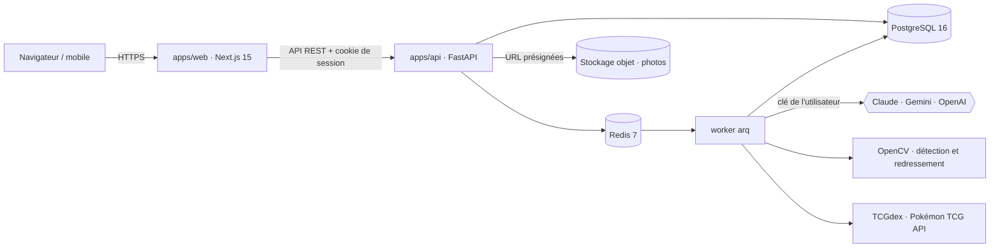
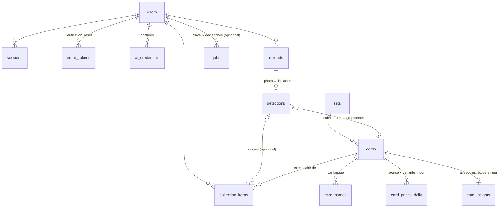

# Architecture — PokeBoyManager

> Proposition soumise à la décision **D1**. Rien n'est encore construit.

## Vue d'ensemble



| Couche | Choix | Pourquoi |
|---|---|---|
| Front | Next.js 15 (App Router), React 19, TypeScript, Tailwind 4, shadcn/ui, TanStack Query, Recharts | rendu serveur pour la page publique, écosystème de composants, courbes de valeur |
| API | FastAPI, Python 3.12, SQLAlchemy 2 async, Alembic, Pydantic v2 | la vision (OpenCV) et les SDK IA sont en Python ; même pile que les autres projets de JF |
| Jobs | arq + Redis | reconnaissance, import du catalogue, relevé des prix : tout est asynchrone et reprenable |
| Base | PostgreSQL 16 + `pg_trgm`, `unaccent` | recherche floue FR/EN, historique de prix volumineux mais simple |
| Photos | S3 (MinIO en local, Object Storage en ligne — D7) | envoi direct du navigateur, pas de fichier sur les serveurs web |
| Monorepo | pnpm workspaces + uv ; client TS généré depuis l'OpenAPI | un seul contrat entre front et back |

## Principe : la base sait, l'IA reconnaît (JF, 19/09/2026)

Tout ce qui est connu d'une carte vit dans **notre base**, peuplé dès le départ pour **toutes** les
cartes : données du catalogue (extension, numéro, rareté, attaques, talents, faiblesses,
légalités, illustrateur, images officielles) et **prix relevés chaque jour pour toutes les cartes**,
pas seulement celles possédées.

L'IA de l'utilisateur ne sert qu'à deux choses : **identifier** la carte photographiée (la
rapprocher d'une carte de la base) et **estimer son état** (propre à chaque exemplaire). Elle ne
recalcule jamais une information que la base possède :
- une photo déjà vue (même empreinte d'image) ne rappelle pas l'IA ;
- anecdotes et étude en jeu sont générées **une fois par carte** et partagées entre tous les
  utilisateurs (`card_insights`) ; la partie déterministe (légalités, attaques, règles) vient du
  catalogue sans IA ;
- **un seul appel par carte, dès le premier tir** (JF, 19/09) : à la reconnaissance, un appel rend
  ensemble l'identification et l'état ; pour le catalogue, un passage par lots (clé plateforme,
  budget plafonné) rend en une fois l'histoire et l'étude en jeu de chaque carte ;
- seule l'évolution du prix change avec le temps, et c'est le relevé quotidien qui la fournit.

## Données (v1)



- **Carte** (`cards`) = l'objet du catalogue, partagé. **Exemplaire** (`collection_items`) = ce que
  possède un utilisateur : langue, variante, état estimé, prix d'achat, photo, date d'ajout.
- `card_prices_daily` : une ligne par carte × source × variante × jour ; la courbe de valeur commence au
  premier relevé (historique rétroactif selon D3).
- `jobs` : file arq (reconnaissance, import catalogue, relevé de prix) ; `user_id` nul pour les
  travaux système (ex : relevé de prix quotidien).

Migration Alembic initiale : `apps/api/migrations/versions/5e0d551b788e_initial_schema.py`
(lot `v0-schema`). Modèles SQLAlchemy : `apps/api/src/pbm_api/models/`. Seed de démonstration
(un utilisateur, trois extensions, neuf cartes) : `apps/api/src/pbm_api/seed.py`.

## Authentification

Lot `v1-auth`. Compte e-mail + mot de passe (argon2id, 10 caractères minimum, refusé s'il
apparaît dans une fuite connue — k-anonymat HIBP). Routes : `POST /auth/{register,login,
logout,verify-email,forgot,reset}` (`apps/api/src/pbm_api/routers/auth.py`).

- **Session** : cookie `HttpOnly; Secure; SameSite=Lax`, identifiant opaque haché (SHA-256)
  en base (`sessions.token_hash`), rotation à chaque connexion (nouvelle session, l'ancienne
  reste valide — sessions multiples). Dépendance `get_current_user` (`pbm_api.auth.
  dependencies`) : à réutiliser par toute route utilisateur des lots suivants — elle ne
  dérive jamais d'un identifiant fourni par le client, uniquement du cookie.
- **CSRF** : double soumission signée (`pbm_api.security.csrf`) — cookie `pbm_csrf` = HMAC
  du jeton de session, à renvoyer dans l'en-tête `X-CSRF-Token` sur toute écriture
  authentifiée (dépendance `require_csrf`, déjà posée sur `/auth/logout`).
- **Limitation** : 5 tentatives / 15 min par compte et par IP (Redis), sur `/auth/login` et
  `/auth/forgot` (`pbm_api.security.rate_limit`).
- **E-mails** : jetons à usage unique (`email_tokens`, expirent, non réutilisables) envoyés
  via SMTP (`pbm_api.email` — Mailpit en dev, D5 provisoire pour le fournisseur en ligne).
- Anti-énumération : réponse identique côté `/auth/register` et `/auth/forgot` que l'e-mail
  soit déjà pris/connu ou non.
- **Pages** (lot `v1-pages-auth`) : `/inscription`, `/connexion`, `/mot-de-passe-oublie`,
  `/verifier?token=…`, `/reinitialiser?token=…` — les liens envoyés par e-mail pointent sur ces
  deux derniers chemins. Garde de route middleware Next.js (`apps/web/src/middleware.ts`) sur
  les pages privées (`/collection`, `/ajouter`, `/carte/*`, `/profil`) : redirection
  `/connexion?next=…` sur simple absence du cookie de session (l'API reste la seule à faire
  autorité en cas de session expirée/révoquée). `apps/api` doit exposer `CORSMiddleware` pour
  ces appels (front et API sur des origines distinctes, y compris en local).

### Identité du compte (lot `v1-identite`)

`users` porte prénom (facultatif), nom, date de naissance, version des conditions
acceptées/horodatage (`pbm_api.legal.CURRENT_TERMS_VERSION`) et un indicateur de changement de
mot de passe forcé (`must_change_password`). Validés à l'inscription (`POST /auth/register`) et à
l'édition (`PATCH /me`) : date de naissance dans le passé, conditions obligatoires, **âge minimum
de 15 ans réservé à l'inscription libre** (RGPD art. 8 — en dessous, seul un compte créé par
l'administrateur, consentement du parent porté par JF, peut couvrir le cas ; `PATCH /me` n'a pas
cette contrainte, un compte existant reste éditable). Réponse de connexion (`UserResponse.
must_change_password`) : le front redirige alors vers l'onglet Sécurité du profil au lieu de la
page demandée — `pbm_api.profile.service.change_password` remet l'indicateur à `False` après le
premier changement réussi.

Commande d'administration (jamais exposée en HTTP) :
```
uv run python -m pbm_api.admin create-user --email … --pseudo … --last-name … \
  --birth-date AAAA-MM-JJ --accept-terms [--first-name …] [--password-stdin] \
  [--must-change-password]
```
Crée un compte déjà vérifié ; le mot de passe vient de l'entrée standard ou est généré et affiché
une seule fois — jamais en argument de commande ni journalisé.

## Catalogue (lot `v2-catalogue`)

- Source : [TCGdex](https://api.tcgdex.net) (FR + EN, sans clé) pour `sets`/`cards`/`card_names`,
  les images officielles, l'illustrateur, les attaques/talents et les légalités (déjà exposées par
  carte, pas besoin d'un second appel). `Set.tcgdex_id` / `Card.tcgdex_id` sont les clés
  d'idempotence de l'import.
- Rapprochement avec [Pokémon TCG API](https://pokemontcg.io) (`Card.ptcg_id`) : les deux
  catalogues n'utilisent pas les mêmes id d'extension (`sv03.5` vs `sv3pt5`, `hgssp` vs `hsp`...) —
  table de correspondance des cas particuliers dans
  `apps/api/src/pbm_api/catalog/reconciliation.py`, testée. Optionnel : une panne de Pokémon TCG
  API (observée flaky le 2026-09-19) dégrade l'import sans le faire échouer, `ptcg_id` reste nul.
- Job `import_catalogue` (arq, `apps/api/src/pbm_api/worker.py`) : idempotent, reprise sur erreur
  (commit par extension). Mode `full` (liste d'extensions ou tout le catalogue) et `incremental`
  (nouvelles extensions seulement, cron hebdomadaire).
- Proxy `GET /img/cards/{id}?size=high|low` (`apps/api/src/pbm_api/routers/images.py`) : sert
  l'image officielle, mise en cache dans le stockage objet (`ObjectStorage`,
  `apps/api/src/pbm_api/s3.py`) au premier accès.

## Recherche catalogue (lot `v2-recherche`)

- `GET /catalog/search?q=&set=&lang=` (`apps/api/src/pbm_api/routers/catalog.py`) : `q` est
  analysé (`pbm_api.catalog.search.parse_query`) pour distinguer un numéro (`25`, `006`,
  `236/217`, formats promo/galerie `TG05`/`GG10`/`SV107`/`XY121`) d'un nom de carte ; `set`
  (code ou nom exact d'extension) et `lang` (`fr`/`en`) filtrent strictement.
- `match_candidates` (`pbm_api.catalog.search`) est la fonction de rapprochement réutilisée par
  la reconnaissance (lot futur) : donné un nom et/ou un numéro déjà extraits, plus des indices
  optionnels d'extension (`set_hint`, bruité — pondère le score sans jamais filtrer) et de total
  de l'extension, elle renvoie les cartes candidates classées par score. Recherche de nom :
  trigram + `unaccent` sur `card_names` (extension `pg_trgm`/`unaccent`, posée par la migration
  initiale), casse et accents ignorés.
- La route essaie plusieurs découpages `<nom> <indice d'extension>` d'une requête libre (ex :
  "Pikachu VMAX Voltage Éclatant" -> nom="Pikachu VMAX", indice="Voltage Éclatant") et garde le
  meilleur score par carte — coût : jusqu'à `len(q.split())` requêtes SQL par recherche,
  acceptable au volume actuel, à revoir si la latence devient sensible.

## Coffre de clés IA

- AES-256-GCM, nonce aléatoire, `user_id` en données associées ; clé maître dans l'environnement du
  serveur, jamais en base. Rotation documentée.
- La clé n'est déchiffrée que dans le worker, au moment de l'appel. L'API ne renvoie qu'un masque
  (`sk-ant-…4f2a`). Un filtre de journalisation masque tout motif de clé ; un test échoue si une clé
  apparaît dans les logs.
- Lot `v1-byok` : routes `GET/PUT/DELETE /me/ai-keys[/{provider}]`, `POST
  /me/ai-keys/{provider}/test` (appel minimal réel au fournisseur — liste de modèles, coût nul),
  `GET/PATCH /me/ai-settings` (fournisseur/modèle par défaut, colonnes `users.ai_default_provider`/
  `ai_default_model`), `GET /me/ai-usage` (table `ai_usage_monthly` : appels, jetons, coût estimé
  par fournisseur et par mois — alimentée plus tard par le worker de reconnaissance, D4 : sans clé
  personnelle la reconnaissance reste désactivée, l'ajout manuel au catalogue reste toujours
  possible). Migration : `apps/api/migrations/versions/d42b0620077e_ai_settings_and_usage.py`.

## Fournisseurs IA (lot `v3-ia-providers`)

Interface unique `AIProvider.extract(images, schema, prompt) -> (objet validé, usage)`
(`apps/api/src/pbm_api/ai/base.py`) : changer de fournisseur ne touche aucune fonctionnalité en
aval — la reconnaissance (§ suivant) n'appelle jamais directement Anthropic/Gemini/OpenAI, elle
passe par `pbm_api.ai.factory.create_provider(provider, api_key)`.

- **Implémentations** (une par fournisseur, `apps/api/src/pbm_api/ai/`) : `AnthropicProvider`
  (`/v1/messages`, défaut `claude-sonnet-5`, économique `claude-haiku-4-5`), `OpenAiProvider`
  (`/v1/chat/completions`, défaut `gpt-4o`), `GeminiProvider` (`generateContent`, défaut
  `gemini-2.5-flash`) — modèle configurable par utilisateur (`users.ai_default_model`, lot
  `v1-byok`), en dur uniquement si l'utilisateur n'a rien choisi. Appels en HTTP direct
  (`httpx`), comme `ProviderKeyTester` (`v1-byok`) : mêmes trois fournisseurs, même raison
  (clé transmise en en-tête, jamais un SDK de plus à auditer/mettre à jour sur un lien à
  ~250 ko/s).
- **Sortie structurée native** : chaque fournisseur reçoit le schéma Pydantic de l'appelant
  traduit en JSON Schema (`pbm_api.ai.json_schema`) — `$ref`/`$defs` repliés et
  `additionalProperties: false` partout pour Anthropic/OpenAI (`output_config.format` /
  `response_format` strict) ; variante OpenAPI restreinte pour Gemini
  (`generationConfig.responseSchema`, sans `$ref`, `Optional[X]` → `{"type": "X", "nullable":
  true}`). La réponse est ensuite validée par Pydantic ; si elle ne valide pas, une seule
  nouvelle tentative est faite en expliquant l'erreur au modèle avant d'abandonner
  (`InvalidExtractionResponseError`).
- **Erreurs normalisées** (`pbm_api.ai.errors`) : `InvalidApiKeyError`, `QuotaExceededError`,
  `ProviderOverloadedError`, `ProviderUnreachableError`, `ContentRefusedError` — chacune porte un
  `user_message` prêt à afficher et à consigner sur le `Job` (mission point 3). La
  correspondance code HTTP → erreur est commune à Anthropic/OpenAI
  (`pbm_api.ai.http_errors`) ; Gemini a la sienne (`gemini_provider._raise_for_gemini_error`) car
  un 400 y couvre aussi bien une clé invalide qu'une requête malformée — distingués par
  `error.status` du corps JSON, pas par le seul code HTTP.
- **Photos** : `pbm_api.ai.images.detect_media_type` sniffe le type MIME depuis les octets
  (JPEG/PNG/WebP), jamais supposé depuis l'extension du fichier.
- **Sans clé réelle sur chimera** : suite automatisée sur réponses enregistrées
  (`apps/api/tests/test_ai_providers.py`, `httpx.MockTransport`) ; essai manuel avec une vraie
  clé : `uv run python scripts/test_ai_extraction_manual.py <provider> <clé>` depuis
  `apps/api`.

## Reconnaissance

1. **Détection** (lot `v3-detection`) : contours OpenCV (Canny + `approxPolyDP`, filtrage par
   ratio 63×88 mm ±12 %, `pbm_api.detection.opencv_pipeline`) + redressement perspective vers un
   recadrage fixe 630×880 px (`pbm_api.detection.geometry`, ordre de lecture ligne par ligne). Un
   second passage sur les mêmes contours (`has_unclaimed_regions`) détecte une zone de la taille
   d'une carte non rattachée à un quadrilatère retenu (cartes qui se touchent, contour fusionné
   rejeté) : c'est le signal de « nombre ou forme incohérent » qui déclenche le repli par boîtes
   englobantes demandées au LLM (`pbm_api.detection.llm_fallback`, un seul appel par photo, pas
   par carte), affinées ensuite par le même pipeline OpenCV dans chaque boîte
   (`pbm_api.detection.pipeline.run_detection`). Déclenché par `POST /uploads/{id}/complete`
   (`Job(type="detect_cards")`, mission `v3-upload`) via un pool `arq` mis en file depuis l'API
   (`pbm_api.queue`, premier job du dépôt enfilé depuis une route HTTP plutôt qu'en cron/CLI) et
   exécuté par `pbm_api.worker.detect_cards_task`. Résultat exposé par `GET
   /uploads/{id}/detections` et `GET /uploads/{id}/detections/{detection_id}/crop`
   (`routers/uploads.py`), bornés au propriétaire de l'envoi. Jeu de test : 30 photos
   **synthétiques** (`pbm_api.detection.synthetic` — aucun appareil photo/carte physique sur
   chimera, voir le compte rendu du lot) couvrant carte seule/classeur 3×3/reflets/table/fond
   clair ; taux de détection mesuré ≥ 95 % une fois le repli LLM actif (`scripts/
   measure_detection_rate.py`), 63 % à l'OpenCV seul (D4 : sans clé IA, ce taux plus bas
   s'applique et l'ajout manuel reste toujours possible).
2. **Extraction** par carte (lot `v3-identification`) : nom, numéro (`236/217`, `XY121`, `TG05`),
   total de l'extension, code d'extension, langue, PV, type, variante — sortie structurée
   validée par schéma (`pbm_api.identification.schemas.CardExtraction`, un champ de confiance
   par valeur), via `AIProvider.extract` (§ précédent, lot `v3-ia-providers`) avec la clé de
   l'utilisateur (`pbm_api.identification.extraction.extract_card`, un seul appel par carte).
3. **Rapprochement** avec le catalogue (`pbm_api.identification.reconciliation.reconcile`) :
   numéro + extension exacts, sinon numéro + nom, sinon recherche floue sur le nom seul — un
   palier n'est tenté que si le précédent n'a rien trouvé, en réutilisant tel quel
   `pbm_api.catalog.search.match_candidates` (`set_code` filtre strictement au premier palier,
   `set_hint` ne fait que pondérer ensuite : un code d'extension mal lu par l'OCR n'écarte jamais
   la bonne carte). Top 3 avec score combiné (score catalogue × confiance moyenne des champs du
   palier retenu) ; au-delà de 0,9 le premier candidat est présélectionné
   (`IdentificationCandidate.preselected`). Cache partagé entre utilisateurs par empreinte
   perceptuelle du recadrage (aHash 64 bits, `pbm_api.identification.fingerprint`, distance de
   Hamming ≤ 6, `pbm_api.identification.cache`/table `identification_cache`) : une carte
   rephotographiée ne rappelle jamais l'IA. Chaîné dans le même job `detect_cards` que la
   détection (`pbm_api.identification.service.run_identification_for_upload`, appelé par
   `pbm_api.worker.detect_cards_task` juste après `run_detection_for_upload`) — pas un second
   aller-retour par la file. Résultat écrit sur `Detection.extraction`/`Detection.candidates`,
   exposé par `GET /uploads/{id}/detections` (`routers/uploads.py`), déjà borné au propriétaire
   de l'envoi. Comparaison visuelle recadrage/image officielle (mission `v3-identification`
   point 3) non implémentée : un second appel IA par carte contredirait le principe ci-dessus
   (« un seul appel IA par carte, dès le premier tir ») — voir le compte rendu du lot. Précision
   mesurée sur un jeu de 100 cartes étiquetées (dont les 9 cartes de démonstration,
   `pbm_api.identification.synthetic`, extractions bruitées de façon déterministe — aucune vraie
   photo/clé IA sur chimera) : top-1 93 %, top-3 99 % (objectif ≥ 95 %,
   `tests/test_identification_synthetic_dataset.py`, `scripts/measure_identification_rate.py`).
4. **Validation humaine** obligatoire (lot `v3-validation`) ; chaque correction alimente le jeu
   de régression.
5. **État** indicatif (centrage mesuré, coins, bords, surface) et drapeau « contrefaçon probable ».

## Anecdotes sourcées (lot `v4-anecdotes`)

- `GET /cards/{card_id}/insights` (`apps/api/src/pbm_api/routers/card_insights.py`) : trois à
  cinq anecdotes courtes, chacune avec `source_url`. Cache partagé `card_insights` (une ligne
  par carte, posée dès `v0-schema`) : générées **une seule fois**, avec la clé IA de
  l'utilisateur qui ouvre la fiche la première fois (D4 : sans clé par défaut,
  `status: "no_ai_key"`, jamais d'appel) — tout utilisateur suivant lit le cache, sans clé.
- Contexte (`pbm_api.insights.context`) : API MediaWiki publique de deux domaines fixes,
  `www.pokepedia.fr` et `bulbapedia.bulbagarden.net` — recherche puis extrait texte brut, jamais
  une URL fournie par le client. Résilient à un wiki muet ou en panne (`fetch_page` ne lève
  jamais).
- Génération (`pbm_api.insights.generation`) : `AIProvider.extract` (fournisseur de
  l'utilisateur, `v3-ia-providers`) sur un prompt qui liste les pages et leurs URLs ; toute
  anecdote dont `source_url` ne figure pas dans le contexte réellement récupéré est rejetée après
  coup (`pbm_api.insights.service`), même si le modèle a ignoré la consigne — défense en
  profondeur contre l'hallucination.
- `POST /cards/{card_id}/insights/report` (table `card_insight_reports`) : bouton « Signaler une
  erreur », un signalement par utilisateur et par carte.
- Verrou consultatif Postgres (`pg_advisory_xact_lock`) : deux requêtes concurrentes sur une
  carte jamais vue ne déclenchent qu'un seul appel IA. Cache positif 180 jours (une anecdote
  sourcée ne se périme pas), négatif 1 jour (une carte sans contexte aujourd'hui peut en trouver
  un demain — jamais un échec permanent silencieux).
- `in_game_study` (étude en jeu, même table `card_insights`) : hors périmètre de ce lot, laissé
  `NULL` — voir § « Étude d'utilisation en jeu (lot `v4-jeu`) ».

## Étude d'utilisation en jeu (lot `v4-jeu`)

`GET /cards/{card_id}/in-game-study` (`apps/api/src/pbm_api/routers/in_game_study.py`) combine
trois sources indépendantes, sur le principe « la base sait, l'IA reconnaît » :

- **Légalités et règle des Prix** (`pbm_api.ingame.rules`, mission point 1) : déterministe,
  recalculée à chaque appel (gratuite, jamais mise en cache) depuis `Card.legal_standard`/
  `legal_expanded` (catalogue TCGdex) et le suffixe du nom de la carte (`ex`/`V`/`VSTAR`/`GX`
  prennent 2 Prix, `VMAX` en prend 3, une carte Pokémon sans suffixe 1 Prix, hors Pokémon
  « non applicable ») — la vraie règle du jeu, jamais une IA.
- **Présence en tournoi** (`pbm_api.ingame.tournaments`/`tournaments_job`, mission point 2),
  source publique Limitless TCG (`robots.txt` sans restriction). Aucun identifiant partagé avec
  notre catalogue : le rapprochement se fait par **date de sortie de l'extension** (`Set.
  release_date`, identique quelle que soit la source), départagée par le nom en cas
  d'ambiguïté, puis vérifiée une seconde fois par le nom anglais affiché en titre de la page
  trouvée — sans cette double vérification, une carte homonyme d'une autre édition afficherait
  la présence en tournoi d'une **autre** carte (risque de la mission : « ne jamais inventer un
  résultat de tournoi », un rapprochement faux serait pire qu'une absence de donnée ; preuve
  réelle du filtre : `scripts/prove_ingame_20_cards.py`, "Charizard ex" ASC/22 correctement
  rejeté — la page existe bien mais titre "Mega Charizard Y ex", pas la carte demandée). Relevé
  **hebdomadaire** par le job arq `weekly_tournament_presence_task` (cron Lundi 08:00, décalé du
  relevé de prix pour ne pas cumuler les deux fenêtres réseau), jamais à la demande (site tiers,
  courtoisie et lenteur du lien de chimera) : bridé aux cartes légales dans au moins un format,
  concurrence 1. Un blocage explicite (HTTP 403/429, `LimitlessBlockedError`) interrompt le
  relevé en cours plutôt que d'insister ; la table `card_tournament_presence` (une ligne par
  carte, `status` "checked"/"unavailable") reste alors sur son dernier état connu — jamais une
  carte "probable" affichée entre-temps (mission : « si ses conditions le permettent ; sinon
  section masquée »).
- **Synthèse IA** (`pbm_api.ingame.generation`/`service`, mission point 3) : même patron de
  cache partagé que les anecdotes (`get_or_create_in_game_study`, verrou consultatif Postgres
  dédié — espace de nom différent de celui des anecdotes, les deux ne se bloquent jamais l'une
  l'autre), stockée dans `card_insights.in_game_study` avec son propre triplet de fraîcheur
  (`game_study_generated_at`/`game_study_cached_until`/`game_study_source_model`, distinct de
  celui des anecdotes : les deux synthèses ne doivent jamais réinitialiser la fraîcheur l'une de
  l'autre). Cache positif 30 jours (plus court que les anecdotes : la méta tournoi bouge chaque
  semaine) — **régénérée si le dernier relevé de tournoi est plus récent que la dernière
  synthèse**, pour ne jamais figer une étude sur une présence en tournoi obsolète. D4 (pas de
  clé IA) : contrairement aux anecdotes, ne masque que la synthèse (`study.status ==
  "no_ai_key"`) — légalités, règle des Prix et présence en tournoi restent visibles, elles ne
  dépendent d'aucune clé.

Essais manuels (aucune clé IA réelle sur chimera) : `scripts/test_ingame_manual.py` (trajet
complet avec une vraie clé), `scripts/prove_ingame_20_cards.py` (preuve du livrable sur 20
cartes réelles, réseau réel vers Limitless TCG, synthèse simulée).

## Prix (lot `v2-prix`)

- Job `daily_prices_task` (arq, cron quotidien 06:00, `apps/api/src/pbm_api/worker.py`) : une
  ligne `card_prices_daily` par carte × source × variante × jour, idempotente (upsert sur la
  contrainte unique). Cardmarket via `TcgdexClient.get_card` (`pricing.cardmarket`, EUR) ;
  TCGplayer via `PtcgClient.list_cards_in_set` groupé par extension déduite de `ptcg_id`
  (`tcgplayer.prices.<variante>`, USD). Extraction : `pbm_api/pricing/extract.py`. Reprise sur
  erreur à la carte/au set près, comme l'import catalogue.
- Job `daily_exchange_rates_task` (même cron) : flux quotidien BCE
  (`eurofxref-daily.xml`) → `exchange_rates_daily` (`pbm_api/pricing/exchange_rates.py`).
  `get_rate_to_eur` retombe sur le taux le plus récent connu à une date donnée (pas de
  publication le week-end), jamais une extrapolation.
- Sonde (mission point 4) : `EmptyPriceRunError` si aucun prix n'a pu être écrit alors que le
  catalogue contient des cartes → le `Job` correspondant passe `failed` avec l'erreur en clair,
  jamais un succès silencieux. Pas d'alerting externe dans ce lot (aucune infra dédiée) : la
  table `jobs` est le canal, à brancher sur une notification par un lot ultérieur.
- Service `valuation` (`pbm_api/pricing/valuation.py`) : `reference_price_eur` = tendance
  Cardmarket, sinon tendance TCGplayer convertie en EUR au taux BCE ; une tendance sans plafond
  de bon sens (marché fin) est écrêtée à 3× le prix moyen du même relevé (risque documenté :
  « ne doit pas faire exploser la valeur d'une collection »). `item_value`/`collection_value`
  appliquent une décote par état (barème M/NM/EX/GD/LP/PL/PO, `CONDITION_MULTIPLIERS`) et
  convertissent dans la devise demandée (`users.preferred_currency`, colonne du lot). Pas de
  route HTTP dans ce lot (back-end seul, testé au niveau service) : `collection_value` filtre
  toujours par `user_id` reçu en paramètre.

## Classement (lot `v4-ranking`)

D6 : les trois classements affichés sur la fiche carte — rang de rareté, rang de valeur dans la
collection personnelle, percentile de valeur dans l'extension.

- Vue matérialisée `card_value_rank` (migration `11f10f8c0f40`, une ligne par carte du
  catalogue) : `reference_price_eur` (tendance Cardmarket la plus récente, sinon tendance
  TCGplayer convertie en EUR au taux le plus récent connu — approximation assumée pour un
  agrégat périodique, contrairement à `pricing.valuation.reference_price_eur` qui aligne prix et
  taux au jour près pour la valeur d'un exemplaire ; écrêtage des tendances aberrantes identique
  à `_sanitize_trend`, maximum entre variantes), `value_percentile` (`PERCENT_RANK()` partitionné
  par `set_id` — 0..1, 0 pour une partition à une seule carte tarifée), `rarity_rank`/
  `rarity_group_size` (`DENSE_RANK()` croissant sur la taille du groupe de cartes partageant la
  même valeur de `cards.rarity` au sein de l'extension : moins de cartes de cette rareté = rang 1
  = plus rare — dérivé uniquement du catalogue, aucune échelle de rareté externe).
- Rafraîchie par `pbm_api.ranking.service.refresh_card_value_rank` (`REFRESH MATERIALIZED VIEW`
  simple, pas `CONCURRENTLY` — verrou exclusif bref accepté pour un job quotidien à faible trafic
  concurrent ; un index unique sur `card_id` est déjà posé pour basculer vers `CONCURRENTLY` plus
  tard sans nouvelle migration), appelée depuis `worker._run_daily_prices` juste après un relevé
  de prix réussi — jamais sur un relevé vide ou en échec.
- Rang de valeur dans la collection (`pbm_api.ranking.service.collection_rank`) : calculé à la
  demande (pas de vue, collection personnelle bien plus petite que le catalogue entier), classe
  les exemplaires d'un utilisateur par `item_value` décroissant (`RANK` SQL standard — égalité de
  valeur = même rang, le suivant saute d'autant) ; un exemplaire sans prix connu n'est pas classé.
- `GET /me/collection/{item}` (`pbm_api/routers/collection.py`) expose les trois classements sur
  un exemplaire. Première route de collection posée dans le dépôt (aucun lot fusionné avant
  celui-ci ne l'avait créée) : volontairement réduite aux champs nécessaires à ce lot —
  `v4-collection` (liste, filtres, `PATCH`/`DELETE`) et `v4-fiche` (données de catalogue
  enrichies) l'étendent sans revenir sur ce qui précède.

## Export et suppression RGPD (lot `v5-rgpd`)

Deux droits exposés depuis « Mon profil » → « Mes données » (`apps/web/src/components/profile/data-tab.tsx`).

**Export** (`pbm_api/export/`) : `POST /me/export` crée un `DataExport` (`pbm_api/models/jobs.py`,
statut `queued`/`running`/`succeeded`/`failed` — même énumération Python que `Job` mais un type
Postgres `export_status` distinct, migration `2e56ba32d5ed`) puis l'enfile vers le worker arq
(`pbm_api.queue.get_arq_pool`, même schéma que `detect_cards_task` posé par `v3-detection` en
parallèle de ce lot — premier job du dépôt enfilé depuis une route HTTP, cf. § « Détection de
cartes »). `pbm_api.worker.export_user_data_task` appelle `export.service.run_export`, qui fait
le travail réel : le worker arq n'étant pas démarré pendant les tests (comme pour
`detect_cards_task`), les tests appellent `run_export` directement pour simuler ce qu'il ferait.

- `pbm_api/export/archive.py` construit le ZIP (`profil.json`, `collection.json`, `collection.csv`,
  `photos/{item_id}.<ext>`) à partir de données déjà lues — aucune dépendance à FastAPI, SQLAlchemy
  ni au stockage, testable seule.
- `pbm_api/export/service.py` lit la collection de l'utilisateur (jointure `collection_items` ×
  `cards` × `sets`, valeur courante via `pricing.valuation.item_value`), récupère les photos déjà
  présentes dans le stockage (`CollectionItem.photo_s3_key` — absentes du ZIP si l'objet a disparu,
  jamais d'échec pour ça), écrit l'archive sous `exports/{user_id}/{export_id}.zip`, génère un
  jeton opaque (`security.tokens`, comme les jetons d'e-mail) valable 24 h et l'envoie par e-mail.
- Le lien de téléchargement (`GET /export/download?token=…`) pointe sur `api_public_url`
  directement — pas sur `app_public_url` (le front) — et ne dépend jamais du cookie de session : il
  doit fonctionner ouvert depuis un autre navigateur que celui de la demande.
- Un échec devient un `DataExport` en `failed` (message en base, jamais renvoyé au client — même
  logique que `worker._run_import`), jamais une exception qui remonte en 500.

**Suppression** (`pbm_api/profile/service.py::delete_account`, posée par `v1-profil`) : le mot de
passe vérifié, la ligne `users` est supprimée et `ondelete="CASCADE"` purge sessions, jetons
d'e-mail, clés IA, exemplaires de collection, envois (et leurs détections) et exports. Risque
documenté du lot (« suppression incomplète : photos dans le stockage objet ») : une cascade SQL
ne touche jamais un objet de stockage — `_storage_keys_to_purge` liste explicitement avatar,
photos de collection, envois originaux, recadrages de détection et archives d'export avant le
`DELETE`, purgés un par un (`storage.delete`, idempotent sur une clé déjà absente).

## Environnements

| | Où | Comment |
|---|---|---|
| Local | chaque machine de la flotte | `docker compose up` (Postgres, Redis, MinIO, Mailpit) |
| CI | GitHub Actions | lint, tests, e2e Playwright |
| UAT / PROD | selon D2 | images construites sur chimera, déployées par devAI (`pull` + `up -d`) |
