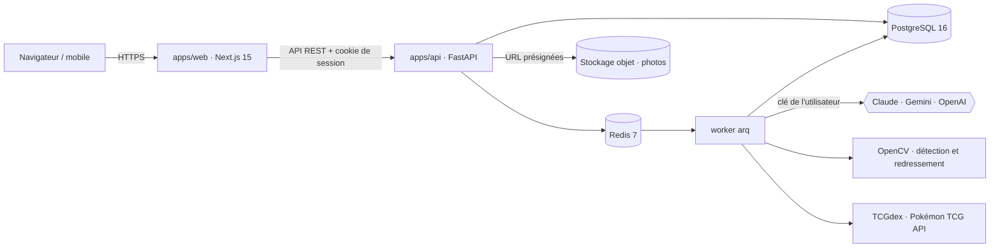
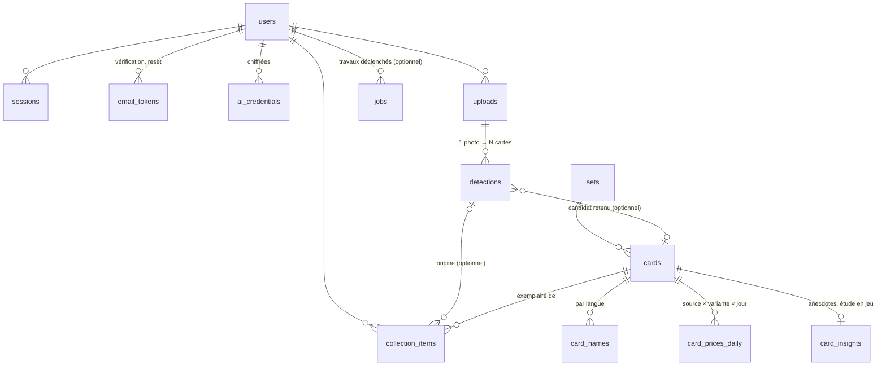

# Architecture — PokeBoyManager

> Proposition soumise à la décision **D1**. Rien n'est encore construit.

## Vue d'ensemble



| Couche | Choix | Pourquoi |
|---|---|---|
| Front | Next.js 15 (App Router), React 19, TypeScript, Tailwind 4, shadcn/ui, TanStack Query, Recharts | rendu serveur pour la page publique, écosystème de composants, courbes de valeur |
| API | FastAPI, Python 3.12, SQLAlchemy 2 async, Alembic, Pydantic v2 | la vision (OpenCV) et les SDK IA sont en Python ; même pile que les autres projets de JF |
| Jobs | arq + Redis | reconnaissance, import du catalogue, relevé des prix : tout est asynchrone et reprenable |
| Base | PostgreSQL 16 + `pg_trgm`, `unaccent` | recherche floue FR/EN, historique de prix volumineux mais simple |
| Photos | S3 (MinIO en local, Object Storage en ligne — D7) | envoi direct du navigateur, pas de fichier sur les serveurs web |
| Monorepo | pnpm workspaces + uv ; client TS généré depuis l'OpenAPI | un seul contrat entre front et back |

## Principe : la base sait, l'IA reconnaît (JF, 19/09/2026)

Tout ce qui est connu d'une carte vit dans **notre base**, peuplé dès le départ pour **toutes** les
cartes : données du catalogue (extension, numéro, rareté, attaques, talents, faiblesses,
légalités, illustrateur, images officielles) et **prix relevés chaque jour pour toutes les cartes**,
pas seulement celles possédées.

L'IA de l'utilisateur ne sert qu'à deux choses : **identifier** la carte photographiée (la
rapprocher d'une carte de la base) et **estimer son état** (propre à chaque exemplaire). Elle ne
recalcule jamais une information que la base possède :
- une photo déjà vue (même empreinte d'image) ne rappelle pas l'IA ;
- anecdotes et étude en jeu sont générées **une fois par carte** et partagées entre tous les
  utilisateurs (`card_insights`) ; la partie déterministe (légalités, attaques, règles) vient du
  catalogue sans IA ;
- **un seul appel par carte, dès le premier tir** (JF, 19/09) : à la reconnaissance, un appel rend
  ensemble l'identification et l'état ; pour le catalogue, un passage par lots (clé plateforme,
  budget plafonné) rend en une fois l'histoire et l'étude en jeu de chaque carte ;
- seule l'évolution du prix change avec le temps, et c'est le relevé quotidien qui la fournit.

## Données (v1)



- **Carte** (`cards`) = l'objet du catalogue, partagé. **Exemplaire** (`collection_items`) = ce que
  possède un utilisateur : langue, variante, état estimé, prix d'achat, photo, date d'ajout.
- `card_prices_daily` : une ligne par carte × source × variante × jour ; la courbe de valeur commence au
  premier relevé (historique rétroactif selon D3).
- `jobs` : file arq (reconnaissance, import catalogue, relevé de prix) ; `user_id` nul pour les
  travaux système (ex : relevé de prix quotidien).

Migration Alembic initiale : `apps/api/migrations/versions/5e0d551b788e_initial_schema.py`
(lot `v0-schema`). Modèles SQLAlchemy : `apps/api/src/pbm_api/models/`. Seed de démonstration
(un utilisateur, trois extensions, neuf cartes) : `apps/api/src/pbm_api/seed.py`.

## Authentification

Lot `v1-auth`. Compte e-mail + mot de passe (argon2id, 10 caractères minimum, refusé s'il
apparaît dans une fuite connue — k-anonymat HIBP). Routes : `POST /auth/{register,login,
logout,verify-email,forgot,reset}` (`apps/api/src/pbm_api/routers/auth.py`).

- **Session** : cookie `HttpOnly; Secure; SameSite=Lax`, identifiant opaque haché (SHA-256)
  en base (`sessions.token_hash`), rotation à chaque connexion (nouvelle session, l'ancienne
  reste valide — sessions multiples). Dépendance `get_current_user` (`pbm_api.auth.
  dependencies`) : à réutiliser par toute route utilisateur des lots suivants — elle ne
  dérive jamais d'un identifiant fourni par le client, uniquement du cookie.
- **CSRF** : double soumission signée (`pbm_api.security.csrf`) — cookie `pbm_csrf` = HMAC
  du jeton de session, à renvoyer dans l'en-tête `X-CSRF-Token` sur toute écriture
  authentifiée (dépendance `require_csrf`, déjà posée sur `/auth/logout`).
- **Limitation** : 5 tentatives / 15 min par compte et par IP (Redis), sur `/auth/login` et
  `/auth/forgot` (`pbm_api.security.rate_limit`).
- **E-mails** : jetons à usage unique (`email_tokens`, expirent, non réutilisables) envoyés
  via SMTP (`pbm_api.email` — Mailpit en dev, D5 provisoire pour le fournisseur en ligne).
- Anti-énumération : réponse identique côté `/auth/register` et `/auth/forgot` que l'e-mail
  soit déjà pris/connu ou non.
- **Pages** (lot `v1-pages-auth`) : `/inscription`, `/connexion`, `/mot-de-passe-oublie`,
  `/verifier?token=…`, `/reinitialiser?token=…` — les liens envoyés par e-mail pointent sur ces
  deux derniers chemins. Garde de route middleware Next.js (`apps/web/src/middleware.ts`) sur
  les pages privées (`/collection`, `/ajouter`, `/carte/*`, `/profil`) : redirection
  `/connexion?next=…` sur simple absence du cookie de session (l'API reste la seule à faire
  autorité en cas de session expirée/révoquée). `apps/api` doit exposer `CORSMiddleware` pour
  ces appels (front et API sur des origines distinctes, y compris en local).

### Identité du compte (lot `v1-identite`)

`users` porte prénom (facultatif), nom, date de naissance, version des conditions
acceptées/horodatage (`pbm_api.legal.CURRENT_TERMS_VERSION`) et un indicateur de changement de
mot de passe forcé (`must_change_password`). Validés à l'inscription (`POST /auth/register`) et à
l'édition (`PATCH /me`) : date de naissance dans le passé, conditions obligatoires, **âge minimum
de 15 ans réservé à l'inscription libre** (RGPD art. 8 — en dessous, seul un compte créé par
l'administrateur, consentement du parent porté par JF, peut couvrir le cas ; `PATCH /me` n'a pas
cette contrainte, un compte existant reste éditable). Réponse de connexion (`UserResponse.
must_change_password`) : le front redirige alors vers l'onglet Sécurité du profil au lieu de la
page demandée — `pbm_api.profile.service.change_password` remet l'indicateur à `False` après le
premier changement réussi.

Commande d'administration (jamais exposée en HTTP) :
```
uv run python -m pbm_api.admin create-user --email … --pseudo … --last-name … \
  --birth-date AAAA-MM-JJ --accept-terms [--first-name …] [--password-stdin] \
  [--must-change-password]
```
Crée un compte déjà vérifié ; le mot de passe vient de l'entrée standard ou est généré et affiché
une seule fois — jamais en argument de commande ni journalisé.

## Catalogue (lot `v2-catalogue`)

- Source : [TCGdex](https://api.tcgdex.net) (FR + EN, sans clé) pour `sets`/`cards`/`card_names`,
  les images officielles, l'illustrateur, les attaques/talents et les légalités (déjà exposées par
  carte, pas besoin d'un second appel). `Set.tcgdex_id` / `Card.tcgdex_id` sont les clés
  d'idempotence de l'import.
- Rapprochement avec [Pokémon TCG API](https://pokemontcg.io) (`Card.ptcg_id`) : les deux
  catalogues n'utilisent pas les mêmes id d'extension (`sv03.5` vs `sv3pt5`, `hgssp` vs `hsp`...) —
  table de correspondance des cas particuliers dans
  `apps/api/src/pbm_api/catalog/reconciliation.py`, testée. Optionnel : une panne de Pokémon TCG
  API (observée flaky le 2026-09-19) dégrade l'import sans le faire échouer, `ptcg_id` reste nul.
- Job `import_catalogue` (arq, `apps/api/src/pbm_api/worker.py`) : idempotent, reprise sur erreur
  (commit par extension). Mode `full` (liste d'extensions ou tout le catalogue) et `incremental`
  (nouvelles extensions seulement, cron hebdomadaire).
- Proxy `GET /img/cards/{id}?size=high|low` (`apps/api/src/pbm_api/routers/images.py`) : sert
  l'image officielle, mise en cache dans le stockage objet (`ObjectStorage`,
  `apps/api/src/pbm_api/s3.py`) au premier accès.
- `Card.element_type` (lot `pbm-carte-remplacement`) : type élémentaire du Pokémon **normalisé au
  code du jeu** (`grass`, `fire`, `water`, `lightning`, `psychic`, `fighting`, `darkness`, `metal`,
  `dragon`, `fairy`, `colorless`), depuis TCGdex `types` via
  `apps/api/src/pbm_api/catalog/element_type.py`. `None` hors Pokémon. **À ne pas confondre** avec
  `Card.energy_type`, qui vaut "Normal"/"Special" pour les seules Énergies (légalité des decks).
  Exposé par `GET /cards/{id}` (`element_type`) et `GET /me/collection` (`element_type`, `hp`) pour
  le visuel de remplacement — voir « Visuel de remplacement » ci-dessous.

## Visuel de remplacement des cartes sans image (lot `pbm-carte-remplacement`)

3 827 des 22 169 cartes du catalogue n'ont **aucune image officielle** (Méga-Ascension 331,
Promo SM 248, Sagesse Entre Ciel et Mer 241, vieilles extensions et promos) et aucun import ne les
rapportera : les sources publiques ne les ont pas. Le front compose alors la carte à partir de ses
vraies données (`apps/web/src/components/replacement-card.tsx`) ; le serveur n'a qu'à fournir les
champs (`element_type`, `hp`, `supertype`, nom, extension, numéro, rareté). Le choix du fond est
déterministe côté client (`empreinte(card_id) % 9`). Détail visuel : `docs/UI-UX.md`.

⚠️ **Dette côté flotte (préexistante, hors de ce lot).** La base de référence catalogue de chimera
(`pbm_catalogue_ref`) est restée à un alembic ancien (`216ae1bf9f95`, vérifié) : elle n'a **ni
`energy_type` ni `stage` ni `element_type`**, et `infra/fleet/export_cards.sql` ne transporte donc
pas `element_type`. La colonne est peuplée en PROD par un **backfill direct** — script
`apps/api/scripts/backfill_element_type.py` : il lit les Pokémon **sans image** dont
`element_type IS NULL`, récupère leur type chez TCGdex (qui expose `types` même sans image) et
n'écrit que cette colonne (additif, idempotent). L'import hebdo étant **insert-only** (garde-fou
explicite de `infra/fleet/import_weekly.sql` : « jamais d'UPDATE »), ce backfill **n'est pas
écrasé** ; en revanche une carte **nouvelle** sans image, ajoutée par l'import hebdo, naît
`element_type = NULL` (fond `colorless`) tant que le backfill n'est pas rejoué. Remettre
`pbm_catalogue_ref` à `head` — ce qui ferait circuler `energy_type`/`stage`/`element_type` dans le
pipeline — reste à faire, séparément. La date et le volume du backfill réellement exécuté sont dans
le compte rendu du lot (`docs/roadmap/comptes-rendus/pbm-carte-remplacement.md`).

## Base de référence complète (lot `v2-catalogue-complet`)

- Complétude de `Card` pour que la fiche n'appelle jamais l'IA pour une information déjà connue :
  `weaknesses`/`resistances` (JSONB, `[{type, value}]`), `retreat_cost`, `variants` (JSONB,
  booléens TCGdex `normal`/`holo`/`reverse`/`firstEdition`/`wPromo`), `rule_marker` — règle
  spéciale ex/GX/V/VMAX/VSTAR/BREAK... TCGdex l'expose tantôt en `suffix` (ex, GX — la carte garde
  un stade d'évolution ordinaire), tantôt directement en `stage` (V/VMAX/VSTAR n'ont pas de
  `suffix`) : `catalog.import_service._rule_marker` réconcilie les deux. `Set.release_date`/
  `logo_url`/`symbol_url` existaient déjà (`v2-catalogue`). Toutes les colonnes JSONB de
  `Card`/`CardInsight` utilisent `none_as_null=True` (sinon un champ absent écrit un scalaire JSON
  `null`, pas un SQL NULL — fausse tout calcul `IS NOT NULL`, voir rapport de complétude).
- `import_catalogue` précharge les détails de carte d'une extension en parallèle (jusqu'à 8,
  réseau seul via `asyncio.gather`+`Semaphore` — les upserts en base restent séquentiels, une
  `AsyncSession` n'est pas sûre en usage concurrent) : décisif pour un import complet
  (~20 000 cartes × 2 langues) sur le lien à ~250 ko/s de chimera.
- `scripts/import_full_catalogue.py` / `scripts/collect_full_daily_prices.py` : lancent
  respectivement `import_catalogue(mode="full")` et `collect_daily_prices` sur toute la base
  pointée par `DATABASE_URL`, avec journal de progression (`progress_callback` optionnel sur les
  deux fonctions) — durées mesurées dans le compte rendu du lot.
- `pbm_api.catalog.completeness.compute_completeness_stats` : extensions/cartes par langue, %
  image/`ptcg_id`/prix/champs de règles, extensions non rapprochées, trous restants (cartes
  importées < `Set.total_cards` officiel TCGdex). `scripts/generate_completeness_report.py` en
  fait `docs/catalogue/COMPLETUDE.md`.
- `scripts/catalogue_seed.sh export|import <DATABASE_URL> [DUMP_PATH]` : graine réutilisable
  (dump/restauration `pg_dump`/`pg_restore` data-only des seules tables `sets`/`cards`/
  `card_names`/`card_prices_daily`, jamais les données utilisateur) pour peupler UAT/PROD sans
  refaire l'import complet au déploiement (D2, hors périmètre de ce lot). Idempotent (DELETE ciblé
  dans l'ordre des dépendances avant restauration) ; dépend de `postgresql-client`
  (`pg_dump`/`pg_restore`/`psql`), présent nativement sur les runners `ubuntu-latest` de GitHub
  Actions, absent par défaut sur chimera (installé localement sans `sudo` pour cette session, voir
  compte rendu).

## Recherche catalogue (lot `v2-recherche`)

- `GET /catalog/search?q=&set=&lang=` (`apps/api/src/pbm_api/routers/catalog.py`) : `q` est
  analysé (`pbm_api.catalog.search.parse_query`) pour distinguer un numéro (`25`, `006`,
  `236/217`, formats promo/galerie `TG05`/`GG10`/`SV107`/`XY121`) d'un nom de carte ; `set`
  (code ou nom exact d'extension) et `lang` (`fr`/`en`) filtrent strictement.
- `match_candidates` (`pbm_api.catalog.search`) est la fonction de rapprochement réutilisée par
  la reconnaissance (lot futur) : donné un nom et/ou un numéro déjà extraits, plus des indices
  optionnels d'extension (`set_hint`, bruité — pondère le score sans jamais filtrer) et de total
  de l'extension, elle renvoie les cartes candidates classées par score. Recherche de nom :
  trigram + `unaccent` sur `card_names` (extension `pg_trgm`/`unaccent`, posée par la migration
  initiale), casse et accents ignorés.
- La route essaie plusieurs découpages `<nom> <indice d'extension>` d'une requête libre (ex :
  "Pikachu VMAX Voltage Éclatant" -> nom="Pikachu VMAX", indice="Voltage Éclatant") et garde le
  meilleur score par carte — coût : jusqu'à `len(q.split())` requêtes SQL par recherche,
  acceptable au volume actuel, à revoir si la latence devient sensible.

## Coffre de clés IA

- AES-256-GCM, nonce aléatoire, `user_id` en données associées ; clé maître dans l'environnement du
  serveur, jamais en base. Rotation documentée.
- La clé n'est déchiffrée que dans le worker, au moment de l'appel. L'API ne renvoie qu'un masque
  (`sk-ant-…4f2a`). Un filtre de journalisation masque tout motif de clé ; un test échoue si une clé
  apparaît dans les logs.
- Lot `v1-byok` : routes `GET/PUT/DELETE /me/ai-keys[/{provider}]`, `POST
  /me/ai-keys/{provider}/test` (appel minimal réel au fournisseur — liste de modèles, coût nul),
  `GET/PATCH /me/ai-settings` (fournisseur/modèle par défaut, colonnes `users.ai_default_provider`/
  `ai_default_model`), `GET /me/ai-usage` (table `ai_usage_monthly` : appels, jetons, coût estimé
  par fournisseur et par mois — alimentée plus tard par le worker de reconnaissance, D4 : sans clé
  personnelle la reconnaissance reste désactivée, l'ajout manuel au catalogue reste toujours
  possible). Migration : `apps/api/migrations/versions/d42b0620077e_ai_settings_and_usage.py`.

## Fournisseurs IA (lot `v3-ia-providers`)

Interface unique `AIProvider.extract(images, schema, prompt) -> (objet validé, usage)`
(`apps/api/src/pbm_api/ai/base.py`) : changer de fournisseur ne touche aucune fonctionnalité en
aval — la reconnaissance (§ suivant) n'appelle jamais directement Anthropic/Gemini/OpenAI, elle
passe par `pbm_api.ai.factory.create_provider(provider, api_key)`.

- **Implémentations** (une par fournisseur, `apps/api/src/pbm_api/ai/`) : `AnthropicProvider`
  (`/v1/messages`, défaut `claude-sonnet-5`, économique `claude-haiku-4-5`), `OpenAiProvider`
  (`/v1/chat/completions`, défaut `gpt-4o`), `GeminiProvider` (`generateContent`, défaut
  `gemini-2.5-flash`) — modèle configurable par utilisateur (`users.ai_default_model`, lot
  `v1-byok`), en dur uniquement si l'utilisateur n'a rien choisi. Appels en HTTP direct
  (`httpx`), comme `ProviderKeyTester` (`v1-byok`) : mêmes trois fournisseurs, même raison
  (clé transmise en en-tête, jamais un SDK de plus à auditer/mettre à jour sur un lien à
  ~250 ko/s).
- **Sortie structurée native** : chaque fournisseur reçoit le schéma Pydantic de l'appelant
  traduit en JSON Schema (`pbm_api.ai.json_schema`) — `$ref`/`$defs` repliés et
  `additionalProperties: false` partout pour Anthropic/OpenAI (`output_config.format` /
  `response_format` strict) ; variante OpenAPI restreinte pour Gemini
  (`generationConfig.responseSchema`, sans `$ref`, `Optional[X]` → `{"type": "X", "nullable":
  true}`). La réponse est ensuite validée par Pydantic ; si elle ne valide pas, une seule
  nouvelle tentative est faite en expliquant l'erreur au modèle avant d'abandonner
  (`InvalidExtractionResponseError`).
- **Erreurs normalisées** (`pbm_api.ai.errors`) : `InvalidApiKeyError`, `QuotaExceededError`,
  `ProviderOverloadedError`, `ProviderUnreachableError`, `ContentRefusedError` — chacune porte un
  `user_message` prêt à afficher et à consigner sur le `Job` (mission point 3). La
  correspondance code HTTP → erreur est commune à Anthropic/OpenAI
  (`pbm_api.ai.http_errors`) ; Gemini a la sienne (`gemini_provider._raise_for_gemini_error`) car
  un 400 y couvre aussi bien une clé invalide qu'une requête malformée — distingués par
  `error.status` du corps JSON, pas par le seul code HTTP.
- **Photos** : `pbm_api.ai.images.detect_media_type` sniffe le type MIME depuis les octets
  (JPEG/PNG/WebP), jamais supposé depuis l'extension du fichier.
- **Sans clé réelle sur chimera** : suite automatisée sur réponses enregistrées
  (`apps/api/tests/test_ai_providers.py`, `httpx.MockTransport`) ; essai manuel avec une vraie
  clé : `uv run python scripts/test_ai_extraction_manual.py <provider> <clé>` depuis
  `apps/api`.

## Reconnaissance

1. **Détection** (lot `v3-detection`) : contours OpenCV (Canny + `approxPolyDP`, filtrage par
   ratio 63×88 mm ±12 %, `pbm_api.detection.opencv_pipeline`) + redressement perspective vers un
   recadrage fixe 630×880 px (`pbm_api.detection.geometry`, ordre de lecture ligne par ligne). Un
   second passage sur les mêmes contours (`has_unclaimed_regions`) détecte une zone de la taille
   d'une carte non rattachée à un quadrilatère retenu (cartes qui se touchent, contour fusionné
   rejeté) : c'est le signal de « nombre ou forme incohérent » qui déclenche le repli par boîtes
   englobantes demandées au LLM (`pbm_api.detection.llm_fallback`, un seul appel par photo, pas
   par carte), affinées ensuite par le même pipeline OpenCV dans chaque boîte
   (`pbm_api.detection.pipeline.run_detection`). Déclenché par `POST /uploads/{id}/complete`
   (`Job(type="detect_cards")`, mission `v3-upload`) via un pool `arq` mis en file depuis l'API
   (`pbm_api.queue`, premier job du dépôt enfilé depuis une route HTTP plutôt qu'en cron/CLI) et
   exécuté par `pbm_api.worker.detect_cards_task`. Résultat exposé par `GET
   /uploads/{id}/detections` et `GET /uploads/{id}/detections/{detection_id}/crop`
   (`routers/uploads.py`), bornés au propriétaire de l'envoi. Jeu de test : 30 photos
   **synthétiques** (`pbm_api.detection.synthetic` — aucun appareil photo/carte physique sur
   chimera, voir le compte rendu du lot) couvrant carte seule/classeur 3×3/reflets/table/fond
   clair ; taux de détection mesuré ≥ 95 % une fois le repli LLM actif (`scripts/
   measure_detection_rate.py`), 63 % à l'OpenCV seul (D4 : sans clé IA, ce taux plus bas
   s'applique et l'ajout manuel reste toujours possible).
2. **Extraction** par carte (lot `v3-identification`) : nom, numéro (`236/217`, `XY121`, `TG05`),
   total de l'extension, code d'extension, langue, PV, type, variante — sortie structurée
   validée par schéma (`pbm_api.identification.schemas.CardExtraction`, un champ de confiance
   par valeur), via `AIProvider.extract` (§ précédent, lot `v3-ia-providers`) avec la clé de
   l'utilisateur (`pbm_api.identification.extraction.extract_card`, un seul appel par carte).
3. **Rapprochement** avec le catalogue (`pbm_api.identification.reconciliation.reconcile`) :
   numéro + extension exacts, sinon numéro + nom, sinon recherche floue sur le nom seul — un
   palier n'est tenté que si le précédent n'a rien trouvé, en réutilisant tel quel
   `pbm_api.catalog.search.match_candidates` (`set_code` filtre strictement au premier palier,
   `set_hint` ne fait que pondérer ensuite : un code d'extension mal lu par l'OCR n'écarte jamais
   la bonne carte). Top 3 avec score combiné (score catalogue × confiance moyenne des champs du
   palier retenu) ; au-delà de 0,9 le premier candidat est présélectionné
   (`IdentificationCandidate.preselected`). Cache partagé entre utilisateurs par empreinte
   perceptuelle du recadrage (aHash 64 bits, `pbm_api.identification.fingerprint`, distance de
   Hamming ≤ 6, `pbm_api.identification.cache`/table `identification_cache`) : une carte
   rephotographiée ne rappelle jamais l'IA. Chaîné dans le même job `detect_cards` que la
   détection (`pbm_api.identification.service.run_identification_for_upload`, appelé par
   `pbm_api.worker.detect_cards_task` juste après `run_detection_for_upload`) — pas un second
   aller-retour par la file. Résultat écrit sur `Detection.extraction`/`Detection.candidates`,
   exposé par `GET /uploads/{id}/detections` (`routers/uploads.py`), déjà borné au propriétaire
   de l'envoi. Précision mesurée sur un jeu de 100 cartes étiquetées (dont les 9 cartes de
   démonstration, `pbm_api.identification.synthetic`, extractions bruitées de façon déterministe
   — aucune vraie photo/clé IA sur chimera) : top-1 93 %, top-3 99 % (objectif ≥ 95 %,
   `tests/test_identification_synthetic_dataset.py`, `scripts/measure_identification_rate.py`).
4. **Comparaison visuelle** (lot `v3-identification-visuelle`), insérée entre le cache
   d'empreinte ci-dessus et l'appel IA : chaque recadrage est aussi comparé à un index des
   images officielles de toutes les cartes (`card_visual_index` — un `full_phash`/`illustration_
   phash` aHash 64 bits par carte × langue, `pbm_api.identification.visual_index.VisualIndex`,
   chargé en mémoire une fois par envoi, jamais par carte). Une correspondance confiante (score ≥
   `CONFIDENT_SCORE_THRESHOLD`, sans concurrent d'une autre carte à moins d'`AMBIGUITY_MARGIN`)
   identifie la carte **sans aucun appel IA** — y compris sans clé configurée (D4) — les champs
   viennent alors directement du catalogue (confiance 1,0, `Detection.identification_method =
   "visuel"`). Un groupe « même illustration » (réimpression/reverse/promo, mission « risques &
   pièges ») n'est jamais tranché par la seule comparaison visuelle (pas d'OCR local disponible
   sur chimera, voir le compte rendu) : ses candidats sont injectés dans le prompt du **même**
   appel `AIProvider.extract` que l'extraction/l'état (jamais un second appel — le principe cadre
   reste respecté), ou laissés à la validation humaine sans clé IA. Mesuré sur un jeu synthétique
   dédié (`pbm_api.identification.visual_synthetic`, images procédurales — même contrainte
   qu'ailleurs, aucune vraie photo/carte sur chimera) : 79 % des cartes reconnues sans IA,
   100 % de précision parmi elles, 0 groupe ambigu résolu à tort avec confiance
   (`tests/test_visual_identification_synthetic_dataset.py`, objectif ≥ 60 % — voir le compte
   rendu du lot pour la mesure de performance/mémoire à l'échelle de production).
5. **Validation humaine** obligatoire (lot `v3-validation`) ; chaque correction alimente le jeu
   de régression.
6. **État** indicatif (lot `v3-etat`), chaîné après l'identification dans le même job `detect_
   cards` (`pbm_api.state.service.run_state_estimation_for_upload`, appelé par `pbm_api.worker.
   detect_cards_task` juste après `run_identification_for_upload`) — jamais un job de plus ni un
   second appel IA. Deux sources combinées en un seul palier global (le plus sévère l'emporte,
   `pbm_api.state.grades.worst_grade`) :
   - **Centrage** mesuré par OpenCV sur le recadrage déjà en stockage (`pbm_api.state.
     centering`), sans jamais dépendre d'une clé IA (D4) : bordure de couleur unie détectée par
     contraste (Lab + seuillage Otsu) contre le cadre intérieur (illustration + texte), marges
     gauche/droite/haut/bas mesurées en pixels, palier par axe puis le plus sévère des deux
     retenu. `None` (pas de mesure inventée) quand aucune bordure nette ne se distingue (carte
     full art/gold, ou reflet de pochette trop marqué) — mesuré sur le jeu synthétique dédié
     (`pbm_api.state.synthetic`, `scripts/measure_centering_rate.py`) : erreur absolue moyenne
     0,5 px, 0 cas non mesurable sur les 7 configurations couvertes.
   - **Coins, bords, surface** demandés au modèle dans le même appel `AIProvider.extract` que
     l'identification (`CardExtraction.corner_wear`/`edge_wear`/`surface_wear`, un palier +
     justification courte + confiance chacun, `pbm_api.identification.extraction`) — jamais un
     second appel, la confiance chute (jamais la note) quand la photo ne permet pas de juger
     (pochette/toploader, reflet, angle).

   Palier global mappé sur l'abréviation Cardmarket (MT/NM/EX/GD/LP/PL/PO,
   `pbm_api.state.grades.CARDMARKET_LABELS`) et une note /10 dérivée directement de
   `pbm_api.pricing.valuation.CONDITION_MULTIPLIERS` (même barème que la décote de valeur, pas
   un second qui pourrait diverger) — toujours accompagné de la mention « estimation indicative,
   pas une gradation professionnelle » (mission « risques & pièges »). Résultat écrit sur
   `Detection.condition_assessment` (colonne distincte d'`extraction` : existe même sans clé IA),
   exposé par `GET /uploads/{id}/detections`, déjà borné au propriétaire de l'envoi.

   **Contrefaçon probable** (`pbm_api.state.counterfeit.assess_counterfeit`, lot `v3-etat`, étendu
   par le lot `v6-contrefacon`) : le signal explicite de l'IA (`CardExtraction.counterfeit_
   suspected`/`counterfeit_reason` — police, couleurs, format du numéro, « indices visuels par le
   LLM ») complété par trois contrôles déterministes, chacun n'agissant que si une carte du
   catalogue a été rapprochée (`has_matched_card`) — jamais l'inverse par excès de prudence quand
   aucune carte n'a pu l'être :
   - une carte perçue comme « gold »/métal (`CardVariantGuess.gold`) alors que la carte rapprochée
     n'est répertoriée sous aucune rareté « gold »/« secret »/« hyper »/« rainbow » connue ;
   - **variante absente du catalogue** (mission `v6-contrefacon` point 1) : holo/reverse holo/1ère
     édition perçus alors que `Card.variants` (JSONB TCGdex) déclare *explicitement* cette
     variante à `false` pour la carte — une clé manquante (catalogue incomplet) ne compte jamais
     comme une preuve, et `full_art`/`other` n'ont aucune clé de catalogue correspondante (pas de
     contrôle possible) ;
   - **numéro impossible** (mission `v6-contrefacon` point 1) : le total de série imprimé
     (`CardExtraction.total`) incohérent avec le total officiel de l'extension reconnue
     (`Set.total_cards`) — jamais le NUMÉRO comparé à ce total, un secret rare le dépasse
     légitimement (ex. 202/198) sans que le total imprimé change, ce qui aurait produit un faux
     positif sur une rareté légitime (mission « risques & pièges »).

   `CollectionItem.counterfeit_suspected` (posé par le lot `v3-etat`, repris du `Detection` par
   `v4-collection`/`v3-validation` lors de la création de l'exemplaire) neutralise la valeur à
   zéro dans `pbm_api.pricing.valuation.item_value`, jamais valorisée comme l'originale ; filtre
   « contrefaçons probables » sur `GET /me/collection` (`v4-collection`) et badge sur l'écran de
   validation (`v3-validation`) et la fiche carte (`v4-fiche`). Toujours « probable », jamais
   « certain » — contestable par l'utilisateur (mission « risques & pièges »). Précision mesurée
   sur un jeu de 60 cartes étiquetées, 30 contrefaçons connues et 30 vraies cartes (dont des
   pièges délibérés : secret rare, variante confirmée par le catalogue, catalogue incomplet —
   `pbm_api.state.counterfeit_synthetic`, aucune vraie photo/carte physique sur chimera) : 100 %
   de précision et de rappel sur ce jeu (`tests/test_state_counterfeit_synthetic_dataset.py`).

## Anecdotes sourcées (lot `v4-anecdotes`)

- `GET /cards/{card_id}/insights` (`apps/api/src/pbm_api/routers/card_insights.py`) : trois à
  cinq anecdotes courtes, chacune avec `source_url`. Cache partagé `card_insights` (une ligne
  par carte, posée dès `v0-schema`) : générées **une seule fois**, avec la clé IA de
  l'utilisateur qui ouvre la fiche la première fois (D4 : sans clé par défaut,
  `status: "no_ai_key"`, jamais d'appel) — tout utilisateur suivant lit le cache, sans clé.
- Contexte (`pbm_api.insights.context`) : API MediaWiki publique de deux domaines fixes,
  `www.pokepedia.fr` et `bulbapedia.bulbagarden.net` — recherche puis extrait texte brut, jamais
  une URL fournie par le client. Résilient à un wiki muet ou en panne (`fetch_page` ne lève
  jamais).
- Génération (`pbm_api.insights.generation`) : `AIProvider.extract` (fournisseur de
  l'utilisateur, `v3-ia-providers`) sur un prompt qui liste les pages et leurs URLs ; toute
  anecdote dont `source_url` ne figure pas dans le contexte réellement récupéré est rejetée après
  coup (`pbm_api.insights.service`), même si le modèle a ignoré la consigne — défense en
  profondeur contre l'hallucination.
- `POST /cards/{card_id}/insights/report` (table `card_insight_reports`) : bouton « Signaler une
  erreur », un signalement par utilisateur et par carte.
- Verrou consultatif Postgres (`pg_advisory_xact_lock`) : deux requêtes concurrentes sur une
  carte jamais vue ne déclenchent qu'un seul appel IA. Cache positif 180 jours (une anecdote
  sourcée ne se périme pas), négatif 1 jour (une carte sans contexte aujourd'hui peut en trouver
  un demain — jamais un échec permanent silencieux).
- `in_game_study` (étude en jeu, même table `card_insights`) : hors périmètre de ce lot, laissé
  `NULL` — voir § « Étude d'utilisation en jeu (lot `v4-jeu`) ».

## Étude d'utilisation en jeu (lot `v4-jeu`)

`GET /cards/{card_id}/in-game-study` (`apps/api/src/pbm_api/routers/in_game_study.py`) combine
trois sources indépendantes, sur le principe « la base sait, l'IA reconnaît » :

- **Légalités et règle des Prix** (`pbm_api.ingame.rules`, mission point 1) : déterministe,
  recalculée à chaque appel (gratuite, jamais mise en cache) depuis `Card.legal_standard`/
  `legal_expanded` (catalogue TCGdex) et le suffixe du nom de la carte (`ex`/`V`/`VSTAR`/`GX`
  prennent 2 Prix, `VMAX` en prend 3, une carte Pokémon sans suffixe 1 Prix, hors Pokémon
  « non applicable ») — la vraie règle du jeu, jamais une IA.
- **Présence en tournoi** (`pbm_api.ingame.tournaments`/`tournaments_job`, mission point 2),
  source publique Limitless TCG (`robots.txt` sans restriction). Aucun identifiant partagé avec
  notre catalogue : le rapprochement se fait par **date de sortie de l'extension** (`Set.
  release_date`, identique quelle que soit la source), départagée par le nom en cas
  d'ambiguïté, puis vérifiée une seconde fois par le nom anglais affiché en titre de la page
  trouvée — sans cette double vérification, une carte homonyme d'une autre édition afficherait
  la présence en tournoi d'une **autre** carte (risque de la mission : « ne jamais inventer un
  résultat de tournoi », un rapprochement faux serait pire qu'une absence de donnée ; preuve
  réelle du filtre : `scripts/prove_ingame_20_cards.py`, "Charizard ex" ASC/22 correctement
  rejeté — la page existe bien mais titre "Mega Charizard Y ex", pas la carte demandée). Relevé
  **hebdomadaire** par le job arq `weekly_tournament_presence_task` (cron Lundi 08:00, décalé du
  relevé de prix pour ne pas cumuler les deux fenêtres réseau), jamais à la demande (site tiers,
  courtoisie et lenteur du lien de chimera) : bridé aux cartes légales dans au moins un format,
  concurrence 1. Un blocage explicite (HTTP 403/429, `LimitlessBlockedError`) interrompt le
  relevé en cours plutôt que d'insister ; la table `card_tournament_presence` (une ligne par
  carte, `status` "checked"/"unavailable") reste alors sur son dernier état connu — jamais une
  carte "probable" affichée entre-temps (mission : « si ses conditions le permettent ; sinon
  section masquée »).
- **Synthèse IA** (`pbm_api.ingame.generation`/`service`, mission point 3) : même patron de
  cache partagé que les anecdotes (`get_or_create_in_game_study`, verrou consultatif Postgres
  dédié — espace de nom différent de celui des anecdotes, les deux ne se bloquent jamais l'une
  l'autre), stockée dans `card_insights.in_game_study` avec son propre triplet de fraîcheur
  (`game_study_generated_at`/`game_study_cached_until`/`game_study_source_model`, distinct de
  celui des anecdotes : les deux synthèses ne doivent jamais réinitialiser la fraîcheur l'une de
  l'autre). Cache positif 30 jours (plus court que les anecdotes : la méta tournoi bouge chaque
  semaine) — **régénérée si le dernier relevé de tournoi est plus récent que la dernière
  synthèse**, pour ne jamais figer une étude sur une présence en tournoi obsolète. D4 (pas de
  clé IA) : contrairement aux anecdotes, ne masque que la synthèse (`study.status ==
  "no_ai_key"`) — légalités, règle des Prix et présence en tournoi restent visibles, elles ne
  dépendent d'aucune clé.

Essais manuels (aucune clé IA réelle sur chimera) : `scripts/test_ingame_manual.py` (trajet
complet avec une vraie clé), `scripts/prove_ingame_20_cards.py` (preuve du livrable sur 20
cartes réelles, réseau réel vers Limitless TCG, synthèse simulée).

## Decks et légalité (lot `v7-decks-api`)

Un joueur construit des decks à partir de sa collection réelle. Deux tables (`pbm_api.models.
decks`) : `decks` (propriétaire, nom) et `deck_cards` (une carte du **catalogue** + une quantité,
unicité `(deck_id, card_id)`). Le choix de référencer le catalogue et non un exemplaire précis
(`collection_items.id`) est **imposé par la décision D10** : une Énergie de base fait partie d'un
deck sans jamais être possédée. « Uniquement avec ses cartes » est donc un contrôle de légalité —
la possession est comptée sur `collection_items` au moment de la lecture — et non une clé
étrangère : vendre une carte rend le deck injouable tout en le laissant lisible et modifiable.

La légalité (`pbm_api.decks.legality`) est **recalculée à chaque lecture, jamais mémorisée** :
c'est ce qui rend la revalidation automatique quand la collection change, sans aucune écriture.
Trois règles (décision D10) : exactement **60** cartes ; **4** exemplaires maximum d'un même
**nom** (deux impressions cumulées), *sauf* Énergies de base ; possession requise, *sauf* Énergies
de base. Le rapport nomme précisément ce qui bloque (`issues`, codes `deck_size` / `copy_limit`
/ `not_owned` / `unsupported_effect`).

Le régime d'une Énergie dépend de sa nature (`pbm_api.decks.energy`) : **de base** = fournie en
quantité illimitée, hors collection et hors règle des 4 (mais comptée dans les 60) ; **spéciale**
= carte ordinaire (possession + règle des 4). La nature vient de `Card.energy_type` (TCGdex
`energyType`, colonne peuplée à l'import) ; pour les cartes importées avant cette colonne, un
repli déterministe sur le nom tranche — l'ensemble des Énergies de base est fermé et connu
(jamais la rareté, qui ne discrimine pas). C'est une application directe du principe « la base
sait » : dès qu'un ré-import peuplera `energy_type`, la classification cesse de dépendre du nom.

Le contrôle « effet non pris en charge par le moteur de règles » (`v7-regles-cartes`) est prévu
dans le moteur de légalité (`unsupported_card_ids`) mais neutre tant que ce moteur n'existe pas :
sans lui, tout effet serait inconnu et aucun deck ne serait jamais légal. Il s'activera par un
seul point d'intégration, sans autre changement.

## Recherche de cartes du constructeur (lot `v7-decks-recherche`)

Deux routes (`apps/api/src/pbm_api/routers/decks.py`, service `pbm_api.decks.card_search`),
déclarées AVANT `/{deck_id}` (sinon FastAPI parse « cards » comme un UUID) :

- `GET /me/decks/cards` : cherche dans le **catalogue** (~22 000 cartes, pas la collection —
  comme `GET /catalog/search`), chaque carte annotée pour l'utilisateur de la session du nombre
  **possédé** (`owned_count`, `is_duplicate` = ≥ 2) et **déjà placé dans le deck édité**
  (`in_deck_count`, quand `deck_id` est fourni ET lui appartient — sinon 404, jamais 403).
  Filtres cumulables : `q` (nom FR/EN accent-insensible **ou** numéro `25`/`025`/`236/217`,
  `parse_query` de `v2-recherche`), `set_id`, `rarity`, `card_type` (supertype), `hp_min`/
  `hp_max`, `owned` (mes cartes), `duplicates`. Tri `sort` (valeur/nom/numéro/date d'ajout, un
  seul appel), pagination **par curseur keyset** (`cursor` = clé de tri + `card_id`, jamais
  OFFSET). `value_eur` vient de la vue matérialisée `card_value_rank` (lot `v4-ranking`), déjà
  rafraîchie par le job de prix — aucun calcul de prix lourd par requête.
- `GET /me/decks/cards/facets` : valeurs de filtre à l'échelle du catalogue (sets, raretés,
  types, bornes de PV) + `owned_card_count`/`duplicate_card_count` propres à l'utilisateur.

**Isolation** : le catalogue est public, l'isolation porte sur les deux annotations (toujours
calculées pour `user.id`, jamais un id du client) et sur `deck_id` (contrôle de propriété →
404). Tests : `apps/api/tests/test_deck_card_search_routes.py` (filtres, comptes de possession,
pagination, accès croisé — B a `owned_count=0` sur la carte de A, et `deck_id` de A → 404).

**Index (migration `f4a1c8d0b7e2`)** : fonction `pbm_immutable_unaccent(text)` (unaccent figé sur
son dictionnaire, donc IMMUTABLE et indexable) + index trigram fonctionnels
`gin (pbm_immutable_unaccent(lower(name)) gin_trgm_ops)` sur `cards` et `card_names` (recherche
par sous-chaîne accent-insensible), btree sur `cards(supertype|rarity|hp)`, composé
`collection_items(user_id, card_id)`. La recherche appelle `pbm_immutable_unaccent` — la
migration DOIT être jouée. Perf (mission point 2, p95 < 150 ms sur 22 000 cartes / 5 000
exemplaires) : `uv run python scripts/measure_deck_card_search_performance.py` depuis `apps/api`
(sème 22 000 cartes, rafraîchit `card_value_rank`, écrit `var/deck-card-search-performance.json`).

**Reste (front)** : la navigation clavier (flèches/Entrée/Échap) et la conformité maquette de
l'écran de recherche appartiennent au constructeur `v7-decks-ui` (couloir CH5), qui monte cet
écran — la route lui rend déjà `owned_count`/`in_deck_count` pour un « ajouter » clavier sans
aller-retour supplémentaire. Report explicite (compte rendu `v7-decks-recherche`), pas un repli
silencieux. « Coût d'attaque » comme critère (cité au contexte, pas au point 1 ni à la définition
de « fini ») est écarté ici : sur `attacks` (JSONB) il exigerait un index dédié pour tenir les
150 ms — à traiter avec `v7-decks-ui` si le besoin se confirme.

## Synchronisation collection → decks (lot `v7-decks-collection-sync`)

La légalité est déjà juste sans écriture (recalcul à la lecture) ; ce lot ajoute la **mémoire** de
la bascule, pour prévenir le joueur qu'une carte vendue a rendu un deck injouable.

- **Table `deck_events`** (`pbm_api.models.decks.DeckEvent`, migration `b2d4f6a8c0e1`) : une ligne
  par deck devenu « à compléter ». `event_type="card_incomplete"`, `reason` ∈ {`removed`,
  `counterfeit`}, `card_id` en `SET NULL` + `card_name` figé (l'historique survit), `detail` JSONB
  (`required`/`owned`/`missing`/`deck_name`), `read_at` (non lue = notification). Index
  `(user_id, read_at)` pour le fil de l'en-tête.
- **Déclencheur** (`pbm_api.decks.collection_sync.record_collection_change`), branché sur
  `collection.service.delete_item` (vente/suppression) et `update_item` (signalement contrefaçon).
  Deux invariants portés par le code : **jamais d'écriture sur `deck_cards`** (le deck n'est pas
  modifié en silence — une partie figée au démarrage n'est donc pas affectée) ; **seule la bascule
  complet→incomplet écrit une alerte** (un doublon vendu laissant un exemplaire suffisant, ou un
  deck déjà incomplet, n'en produit aucune). Les Énergies de base sont ignorées (fournies, D10).
- **Suggestions de remplacement** (`pbm_api.decks.replacements`, `GET /me/decks/{deck}/cards/{card}/
  replacements`) : cartes **possédées** (hors contrefaçon), classées type→rôle/stade→coût d'attaque
  le plus proche→nombre d'exemplaires, chacune avec sa raison. **Une seule requête**, **aucun appel
  IA** (cœur pur `rank_replacements`, coût d'attaque = attaque la moins chère de `Card.attacks`).
- **Routes** (toutes bornées au `user_id` de la session, `/alerts` déclarée avant `/{deck_id}`) :
  `GET /me/decks/alerts` (fil + `unread_count`), `POST /me/decks/alerts/read`, `GET /me/decks/{deck}/
  history`. Tests : `apps/api/tests/test_deck_collection_sync.py` (scénarios mission + accès croisé)
  et `test_deck_replacements.py` (classement pur).

## Prix (lot `v2-prix`)

- Job `daily_prices_task` (arq, cron quotidien 06:00, `apps/api/src/pbm_api/worker.py`) : une
  ligne `card_prices_daily` par carte × source × variante × jour, idempotente (upsert sur la
  contrainte unique). Cardmarket via `TcgdexClient.get_card` (`pricing.cardmarket`, EUR) ;
  TCGplayer via `PtcgClient.list_cards_in_set` groupé par extension déduite de `ptcg_id`
  (`tcgplayer.prices.<variante>`, USD). Extraction : `pbm_api/pricing/extract.py`. Reprise sur
  erreur à la carte/au set près, comme l'import catalogue.
- Job `daily_exchange_rates_task` (même cron) : flux quotidien BCE
  (`eurofxref-daily.xml`) → `exchange_rates_daily` (`pbm_api/pricing/exchange_rates.py`).
  `get_rate_to_eur` retombe sur le taux le plus récent connu à une date donnée (pas de
  publication le week-end), jamais une extrapolation.
- Sonde (mission point 4) : `EmptyPriceRunError` si aucun prix n'a pu être écrit alors que le
  catalogue contient des cartes → le `Job` correspondant passe `failed` avec l'erreur en clair,
  jamais un succès silencieux. Pas d'alerting externe dans ce lot (aucune infra dédiée) : la
  table `jobs` est le canal, à brancher sur une notification par un lot ultérieur.
- Service `valuation` (`pbm_api/pricing/valuation.py`) : `reference_price_eur` = tendance
  Cardmarket, sinon tendance TCGplayer convertie en EUR au taux BCE ; une tendance sans plafond
  de bon sens (marché fin) est écrêtée à 3× le prix moyen du même relevé (risque documenté :
  « ne doit pas faire exploser la valeur d'une collection »). `item_value`/`collection_value`
  appliquent une décote par état (barème M/NM/EX/GD/LP/PL/PO, `CONDITION_MULTIPLIERS`) et
  convertissent dans la devise demandée (`users.preferred_currency`, colonne du lot). Pas de
  route HTTP dans ce lot (back-end seul, testé au niveau service) : `collection_value` filtre
  toujours par `user_id` reçu en paramètre.

## Classement (lot `v4-ranking`)

D6 : les trois classements affichés sur la fiche carte — rang de rareté, rang de valeur dans la
collection personnelle, percentile de valeur dans l'extension.

- Vue matérialisée `card_value_rank` (migration `11f10f8c0f40`, une ligne par carte du
  catalogue) : `reference_price_eur` (tendance Cardmarket la plus récente, sinon tendance
  TCGplayer convertie en EUR au taux le plus récent connu — approximation assumée pour un
  agrégat périodique, contrairement à `pricing.valuation.reference_price_eur` qui aligne prix et
  taux au jour près pour la valeur d'un exemplaire ; écrêtage des tendances aberrantes identique
  à `_sanitize_trend`, maximum entre variantes), `value_percentile` (`PERCENT_RANK()` partitionné
  par `set_id` — 0..1, 0 pour une partition à une seule carte tarifée), `rarity_rank`/
  `rarity_group_size` (`DENSE_RANK()` croissant sur la taille du groupe de cartes partageant la
  même valeur de `cards.rarity` au sein de l'extension : moins de cartes de cette rareté = rang 1
  = plus rare — dérivé uniquement du catalogue, aucune échelle de rareté externe).
- Rafraîchie par `pbm_api.ranking.service.refresh_card_value_rank` (`REFRESH MATERIALIZED VIEW`
  simple, pas `CONCURRENTLY` — verrou exclusif bref accepté pour un job quotidien à faible trafic
  concurrent ; un index unique sur `card_id` est déjà posé pour basculer vers `CONCURRENTLY` plus
  tard sans nouvelle migration), appelée depuis `worker._run_daily_prices` juste après un relevé
  de prix réussi — jamais sur un relevé vide ou en échec.
- Rang de valeur dans la collection (`pbm_api.ranking.service.collection_rank`) : calculé à la
  demande (pas de vue, collection personnelle bien plus petite que le catalogue entier), classe
  les exemplaires d'un utilisateur par `item_value` décroissant (`RANK` SQL standard — égalité de
  valeur = même rang, le suivant saute d'autant) ; un exemplaire sans prix connu n'est pas classé.
- `GET /me/collection/{item}` (`pbm_api/routers/collection.py`) expose les trois classements sur
  un exemplaire. Première route de collection posée dans le dépôt (aucun lot fusionné avant
  celui-ci ne l'avait créée) : volontairement réduite aux champs nécessaires à ce lot —
  `v4-collection` (liste, filtres, `PATCH`/`DELETE`) et `v4-fiche` (données de catalogue
  enrichies) l'étendent sans revenir sur ce qui précède.

## Export et suppression RGPD (lot `v5-rgpd`)

Deux droits exposés depuis « Mon profil » → « Mes données » (`apps/web/src/components/profile/data-tab.tsx`).

**Export** (`pbm_api/export/`) : `POST /me/export` crée un `DataExport` (`pbm_api/models/jobs.py`,
statut `queued`/`running`/`succeeded`/`failed` — même énumération Python que `Job` mais un type
Postgres `export_status` distinct, migration `2e56ba32d5ed`) puis l'enfile vers le worker arq
(`pbm_api.queue.get_arq_pool`, même schéma que `detect_cards_task` posé par `v3-detection` en
parallèle de ce lot — premier job du dépôt enfilé depuis une route HTTP, cf. § « Détection de
cartes »). `pbm_api.worker.export_user_data_task` appelle `export.service.run_export`, qui fait
le travail réel : le worker arq n'étant pas démarré pendant les tests (comme pour
`detect_cards_task`), les tests appellent `run_export` directement pour simuler ce qu'il ferait.

- `pbm_api/export/archive.py` construit le ZIP (`profil.json`, `collection.json`, `collection.csv`,
  `photos/{item_id}.<ext>`) à partir de données déjà lues — aucune dépendance à FastAPI, SQLAlchemy
  ni au stockage, testable seule.
- `pbm_api/export/service.py` lit la collection de l'utilisateur (jointure `collection_items` ×
  `cards` × `sets`, valeur courante via `pricing.valuation.item_value`), récupère les photos déjà
  présentes dans le stockage (`CollectionItem.photo_s3_key` — absentes du ZIP si l'objet a disparu,
  jamais d'échec pour ça), écrit l'archive sous `exports/{user_id}/{export_id}.zip`, génère un
  jeton opaque (`security.tokens`, comme les jetons d'e-mail) valable 24 h et l'envoie par e-mail.
- Le lien de téléchargement (`GET /export/download?token=…`) pointe sur `api_public_url`
  directement — pas sur `app_public_url` (le front) — et ne dépend jamais du cookie de session : il
  doit fonctionner ouvert depuis un autre navigateur que celui de la demande.
- Un échec devient un `DataExport` en `failed` (message en base, jamais renvoyé au client — même
  logique que `worker._run_import`), jamais une exception qui remonte en 500.

**Suppression** (`pbm_api/profile/service.py::delete_account`, posée par `v1-profil`) : le mot de
passe vérifié, la ligne `users` est supprimée et `ondelete="CASCADE"` purge sessions, jetons
d'e-mail, clés IA, exemplaires de collection, envois (et leurs détections) et exports. Risque
documenté du lot (« suppression incomplète : photos dans le stockage objet ») : une cascade SQL
ne touche jamais un objet de stockage — `_storage_keys_to_purge` liste explicitement avatar,
photos de collection, envois originaux, recadrages de détection et archives d'export avant le
`DELETE`, purgés un par un (`storage.delete`, idempotent sur une clé déjà absente).

## Environnements

| | Où | Comment |
|---|---|---|
| Local | chaque machine de la flotte | `docker compose up` (Postgres, Redis, MinIO, Mailpit) |
| CI | GitHub Actions | lint, tests, e2e Playwright |
| UAT / PROD | selon D2 | images construites sur chimera, déployées par devAI (`pull` + `up -d`) |

---

# Repères d'implémentation par lot

> Ces sections viennent de `CLAUDE.md`, où elles s'empilaient lot après lot (structuration du
> 22/09/2026). Elles donnent les **chemins de code et les pièges mesurés** ; la vue d'ensemble
> reste dans les sections thématiques ci-dessus.
>
> **Recoupement connu, à résorber** : « Détection de cartes » et « Identification des cartes »
> redisent, en plus court, ce que décrit déjà § *Reconnaissance*. Rien n'a été supprimé pour ne
> rien perdre ; la fusion des deux versions mérite sa propre relecture.

## Détection de cartes (lot `v3-detection`)

Pipeline `pbm_api.detection.pipeline.run_detection` : contours OpenCV (`opencv_pipeline.py`,
ratio 63×88 mm) + redressement perspective (`geometry.py`, recadrage fixe 630×880) ; repli par
boîtes englobantes demandées au LLM (`llm_fallback.py`, un seul appel par photo) quand
`has_unclaimed_regions` signale une zone de la taille d'une carte non rattachée à un
quadrilatère retenu, affinées ensuite par le même OpenCV dans chaque boîte. Orchestration
DB/stockage (`detection/service.py`) déclenchée par `pbm_api.worker.detect_cards_task`, mis en
file depuis `POST /uploads/{id}/complete` via `pbm_api.queue.get_arq_pool` — **premier job du
dépôt enfilé depuis une route HTTP** (les autres jobs `arq` du dépôt sont en cron ou CLI direct).
Résultat consultable par `GET /uploads/{id}/detections` et `.../detections/{id}/crop`
(`routers/uploads.py`), bornés au propriétaire de l'envoi. Jeu de test : 30 photos
**synthétiques** (`pbm_api.detection.synthetic` — aucun appareil photo/carte physique sur
chimera) ; mise au point : `uv run python scripts/measure_detection_rate.py [--provider <p>
--api-key <clé>]` depuis `apps/api`, écrit une image annotée de contrôle par photo. Détail :
`docs/ARCHITECTURE.md` § « Reconnaissance ».

## Identification des cartes (lot `v3-identification`)

Chaîné dans le même job `detect_cards` que la détection (`pbm_api.identification.service.
run_identification_for_upload`, appelé par `pbm_api.worker.detect_cards_task` juste après
`run_detection_for_upload`) — jamais un second aller-retour par la file. Pour chaque `Detection`
en attente : empreinte perceptuelle du recadrage (aHash 64 bits, `pbm_api.identification.
fingerprint.compute_phash`) ; touchée dans `identification_cache` (distance de Hamming ≤ 6,
`pbm_api.identification.cache`, cache partagé entre utilisateurs comme `card_insights`), le
résultat est réutilisé sans appel IA ; sinon un appel `AIProvider.extract`
(`pbm_api.identification.extraction.extract_card`, schéma `CardExtraction` — nom, numéro, total,
code d'extension, langue, PV, type, variante, confiance par champ) puis rapprochement catalogue
(`pbm_api.identification.reconciliation.reconcile` : numéro + extension exacts, sinon numéro +
nom, sinon recherche floue sur le nom seul, en réutilisant `pbm_api.catalog.search.
match_candidates` tel quel) — top 3 avec score combiné (score catalogue × confiance moyenne),
présélection au-delà de 0,9. Résultat écrit sur `Detection.extraction`/`Detection.candidates`,
exposé par `GET /uploads/{id}/detections`. Jeu de 100 cartes étiquetées et mesure de précision :
`uv run pytest tests/test_identification_synthetic_dataset.py` (fait foi, CI) ou `uv run python
scripts/measure_identification_rate.py` (mise au point, `report.json`) ; essai manuel avec une
vraie clé : `uv run python scripts/test_identification_manual.py <provider> <clé>` depuis
`apps/api`. Détail : `docs/ARCHITECTURE.md` § « Reconnaissance ».

## Comparaison visuelle (lot `v3-identification-visuelle`)

Insérée entre le cache d'empreinte ci-dessus et l'appel IA, dans `pbm_api.identification.
service._identify_one` : chaque recadrage est comparé à l'index des images officielles de toutes
les cartes (table `card_visual_index` — `full_phash`/`illustration_phash`, aHash 64 bits sur
l'image entière et sur sa seule zone d'illustration, `pbm_api.identification.visual_geometry`) ;
`pbm_api.identification.visual_index.VisualIndex` charge l'index en mémoire (numpy) une fois par
envoi, jamais par carte — recherche par XOR + comptage de bits vectorisé, pas en SQL (volume visé
~20 000 cartes × 2 langues, largement au-delà de ce que `identification_cache` documente comme
acceptable en scan SQL). Une correspondance confiante (`resolve`, `CONFIDENT_SCORE_THRESHOLD` =
0,85, sans concurrent d'une autre carte à moins d'`AMBIGUITY_MARGIN` = 0,06) identifie la carte
**sans aucun appel IA**, y compris sans clé configurée (D4) : les champs viennent directement du
catalogue (`pbm_api.identification.visual_resolve.build_confident_extraction`, confiance 1,0,
jamais repassés par le rapprochement flou), `Detection.identification_method = "visuel"` (colonne
posée par ce lot, comme `IdentificationCache.method`) — sert au badge « reconnue sans IA » de
l'écran de validation (`apps/web/src/app/ajouter/validation/detection-card.tsx`). Un groupe
« même illustration » (réimpression/reverse/promo) n'est jamais tranché par la seule comparaison
visuelle (pas d'OCR local disponible sur chimera — ni `tesseract` ni `sudo apt` sur cette
session, voir le compte rendu) : ses candidats sont injectés dans le prompt du **même** appel
`AIProvider.extract` (`pbm_api.identification.extraction.extract_card(..., visual_hints=...)`),
ou laissés à la validation humaine sans clé IA (`identification_method = "aucun"`, candidats tout
de même exposés). Construction de l'index (hors serveur de PROD) : `uv run python
scripts/build_visual_index.py [--limit N] [--languages fr,en]` — télécharge l'image officielle
basse définition par carte × langue (déduction d'URL par langue, `pbm_api.identification.
visual_build.image_url_for_language`), la met aussi en cache dans le stockage objet
(`cards/{id}/{langue}/low.webp`, réutilisée par le proxy `/img/cards/{id}`), idempotent et
reprenable (une carte déjà indexée est sautée). Mesure sur jeu synthétique (images procédurales,
`pbm_api.identification.visual_synthetic` — même contrainte qu'ailleurs, aucune vraie
photo/carte) : `uv run pytest tests/test_visual_identification_synthetic_dataset.py` (fait foi,
CI, objectif ≥ 60 % reconnu sans IA) ou `uv run python
scripts/measure_visual_identification_rate.py` (mise au point, `report.json`) ; performance/
mémoire à l'échelle de production (empreintes aléatoires, pas besoin d'images réelles) : `uv run
python scripts/measure_visual_index_performance.py`. Détail : `docs/ARCHITECTURE.md` §
« Reconnaissance ».

## État estimé de l'exemplaire (lot `v3-etat`)

Chaîné après l'identification dans le même job `detect_cards`
(`pbm_api.state.service.run_state_estimation_for_upload`, appelé par
`pbm_api.worker.detect_cards_task` juste après `run_identification_for_upload`) — jamais un job
ni un appel IA de plus. Deux sources combinées en un palier global (le plus sévère l'emporte,
`pbm_api.state.grades.worst_grade`) : centrage mesuré par OpenCV sur le recadrage déjà en
stockage (`pbm_api.state.centering`, sans clé IA requise, `None` plutôt qu'une mesure inventée
sans bordure distincte) ; coins/bords/surface demandés à l'IA dans le même appel que
l'identification (`CardExtraction.corner_wear`/`edge_wear`/`surface_wear`, `pbm_api.
identification.extraction`) — `None` (jamais inventés) quand la carte a été reconnue par le seul
index visuel (lot `v3-identification-visuelle`, `identification_method = "visuel"`, aucun appel
IA fait) : l'état global retombe alors sur le centrage seul, `worst_grade` ignore les paliers
absents. Palier mappé sur l'abréviation Cardmarket et une note /10 dérivée de
`pbm_api.pricing.valuation.CONDITION_MULTIPLIERS` (même barème que la décote de valeur). Résultat
sur `Detection.condition_assessment`, exposé par `GET /uploads/{id}/detections`. Contrefaçon
probable (`pbm_api.state.counterfeit`) : signal IA + contrôle déterministe (carte « gold » perçue
mais rareté catalogue non confirmée) ; `CollectionItem.counterfeit_suspected` neutralise la
valeur à zéro dans `pbm_api.pricing.valuation.item_value`. Mise au point centrage : `uv run
python scripts/measure_centering_rate.py` depuis `apps/api` (jeu synthétique dédié,
`pbm_api.state.synthetic` — aucune carte physique sur chimera). Détail :
`docs/ARCHITECTURE.md` § « Reconnaissance ».

## Identité du compte (lot `v1-identite`)

`users` porte prénom (facultatif), nom, date de naissance, version/horodatage des conditions
acceptées et `must_change_password`. Validations dans `pbm_api.auth.service` (inscription) et
`pbm_api.profile.service` (`PATCH /me`) : date de naissance passée, conditions obligatoires, âge
minimum 15 ans réservé à l'inscription libre (RGPD art. 8) — contournable seulement par la
commande d'administration (consentement du parent porté par JF) :
```
uv run python -m pbm_api.admin create-user --email … --pseudo … --last-name … \
  --birth-date AAAA-MM-JJ --accept-terms [--password-stdin] [--must-change-password]
```
Mot de passe lu sur l'entrée standard ou généré et affiché une seule fois — jamais en argument ni
journalisé. Détail : `docs/ARCHITECTURE.md` § « Identité du compte ».

## Coffre de clés IA (lot `v1-byok`)

Routes (`apps/api/src/pbm_api/routers/ai_keys.py`) : `GET/PUT/DELETE /me/ai-keys[/{provider}]`,
`POST /me/ai-keys/{provider}/test`, `GET/PATCH /me/ai-settings`, `GET /me/ai-usage`. Chiffrement
AES-256-GCM (`pbm_api.security.crypto`, `user_id` en données associées) ; filtre anti-fuite de
clé dans les journaux (`pbm_api.security.log_filter`, installé au démarrage) et dans les
réponses 422 de validation (`pbm_api.security.validation_errors` — le comportement par défaut
de FastAPI renverrait sinon la valeur soumise en clair sur une clé trop courte/longue). Le test
d'une clé
appelle réellement le fournisseur (liste de modèles, coût nul) via `pbm_api.ai.providers.
ProviderKeyTester`, injecté par dépendance FastAPI — remplacé par un double dans les tests
(aucune clé IA réelle disponible sur chimera) ; essai manuel avec une vraie clé :
`uv run python scripts/test_ai_key_manual.py <provider> <clé>` depuis `apps/api`.

## Export et suppression RGPD (lot `v5-rgpd`)

Routes (`apps/api/src/pbm_api/routers/export.py`) : `POST /me/export` (session + CSRF) crée le
`DataExport` et l'enfile vers le worker (`pbm_api.queue.get_arq_pool`, même schéma que
`detect_cards_task` ci-dessus — `export_user_data_task` fait le travail réel), `GET
/me/export/{id}` (statut), `GET /export/download?token=…` (sans session, jeton opaque valable
24 h envoyé par e-mail — comme un jeton d'e-mail de `v1-auth`, jamais un cookie). Le ZIP
(`pbm_api.export.archive`) contient `profil.json`, `collection.json`, `collection.csv` et
`photos/` (exemplaires avec `photo_s3_key`) ; aucune clé IA n'y figure jamais (elles ne sont de
toute façon jamais déchiffrables hors de leur usage fournisseur). La suppression de compte
(`pbm_api.profile.service.delete_account`, posée par `v1-profil`) purge désormais aussi les
objets de stockage (photos de collection, envois, recadrages de détection, archives d'export)
avant le `DELETE` en cascade — pas seulement l'avatar.

## Decks : légalité et sauvegarde (lot `v7-decks-api`)

Routes (`apps/api/src/pbm_api/routers/decks.py`, préfixe `/me/decks`, toutes bornées au
propriétaire via la session — jamais un id reçu du client, un deck d'autrui renvoie 404, pas
403) : `POST /me/decks` (création, cartes initiales facultatives), `GET /me/decks` (liste +
légalité par deck), `GET /me/decks/{id}` (détail + rapport de légalité), `PATCH /me/decks/{id}`
(renommer), `DELETE /me/decks/{id}`, `POST /me/decks/{id}/duplicate`,
`PUT /me/decks/{id}/cards/{card_id}` (poser/mettre à jour une quantité, idempotent),
`DELETE /me/decks/{id}/cards/{card_id}`. Écritures protégées par `require_csrf`.

Modèle (`pbm_api.models.decks`) : `decks` (nom, propriétaire) et `deck_cards` (`card_id` du
CATALOGUE + `quantity`, unicité `(deck_id, card_id)`). `deck_cards` référence le catalogue, PAS
un `collection_items.id` : imposé par D10 (une Énergie de base fait partie d'un deck sans être
possédée) et robustesse — vendre un exemplaire rend le deck injouable mais le laisse lisible et
modifiable (risque du lot), ce qu'une FK vers la collection casserait. « Uniquement avec ses
cartes » est donc un CONTRÔLE DE LÉGALITÉ (possession comptée sur `collection_items`), pas une
clé étrangère.

Légalité (`pbm_api.decks.legality`, logique pure, testable sans base) — recalculée à CHAQUE
lecture, jamais mémorisée : une carte vendue rend le deck injouable sans aucune écriture
(« revalidation quand la collection change », mission point 3). Règles (D10) : exactement 60
cartes ; 4 exemplaires maximum par NOM (deux impressions d'un même nom cumulées), sauf Énergies
de base ; possession requise sauf Énergies de base ; rapport lisible (`issues`, codes
`deck_size`/`copy_limit`/`not_owned`/`unsupported_effect`).

Classement des Énergies (`pbm_api.decks.energy`, décision D10) : Énergie de BASE = illimitée,
fournie, jamais décomptée de la collection, hors règle des 4 (mais comptée dans les 60) ; Énergie
SPÉCIALE = carte comme les autres (possession + règle des 4). Source de vérité : `Card.energy_type`
(TCGdex `energyType`, colonne ajoutée par ce lot, peuplée à l'import) ; à défaut (cartes importées
avant la colonne, `energy_type IS NULL`), repli sur le nom — l'ensemble des Énergies de base est
fermé, calibré sur les 514 cartes `supertype = "Énergie"` du catalogue (l'Éclair s'écrit
« Énergie Électrique » ET « Énergie Electrik », la casse varie). Jamais sur la rareté (une Énergie
de base existe en « Commune » comme en « Magnifique rare »).

Effet non pris en charge : la vérification « une carte dont l'effet n'est pas géré par le moteur
(`v7-regles-cartes`) est refusée » est câblée (`legality.unsupported_card_ids`, code
`unsupported_effect`) mais NEUTRE tant que ce moteur n'existe pas dans le dépôt — sans moteur,
tout effet serait « non pris en charge » et aucun deck ne serait jamais légal. S'activera en
remplaçant le corps de cette fonction par un appel au moteur, sans autre changement — report
explicite dans le compte rendu, pas un repli silencieux.

Migration `d1c7a3f0b2e4` (tables `decks`/`deck_cards` + colonne `cards.energy_type`, nullable).
Tests : `apps/api/tests/test_deck_legality.py` (moteur pur : D10, 60/4/possession),
`apps/api/tests/test_deck_routes.py` (CRUD, accès croisé B→404, revalidation après vente, CSRF).
Aucun écran dans ce lot (back-end) : le constructeur est `v7-decks-ui` (couloir CH5).

## Statistiques de deck (lot `v7-decks-stats`)

`GET /me/decks/{deck_id}/stats` (borné au propriétaire, 404 sinon) renvoie les agrégats chiffrés
d'un deck (`pbm_api.decks.stats.compute`, logique pure testée sur des decks connus, pondérée par
les quantités) :

- **répartition par rôle** (`by_role`) — partition en `attaquant` / `mur` / `soutien` / `energie`,
  heuristique de catalogue documentée (`mur` = Pokémon à PV ≥ 200 ; un Pokémon qui attaque est un
  attaquant, sinon un soutien ; Dresseur = soutien). La somme égale `card_count` ;
- **par type de carte** (`by_supertype`) et **par type élémentaire** (`type_distribution`, Pokémon
  seulement ; `untyped_pokemon` compte ceux sans type renseigné) ;
- **courbe des coûts d'attaque** (`attack_cost_curve`) — nombre d'énergies par attaque
  (`Card.attacks`, `cost` TCGdex) ;
- **PV moyens** (`average_hp`, pondérés) et **structure d'évolution** (`stage_distribution` +
  `has_basic_pokemon` / `evolution_copies_without_base`) ;
- **cartes spéciales** (`special_cards` = `rule_marker` présent ou Énergie spéciale) ;
- **valeur marchande** (`value.total_eur`) via `pbm_api.pricing.valuation.bulk_reference_prices_eur`
  (variante `normal`), Énergies de base exclues (fournies) ; un prix manquant n'est jamais compté 0
  (`value.missing_price_cards`) ;
- **part de doublons** (`duplicate_ratio`) — exemplaires au-delà du premier, hors Énergies de base.

Faute de champ `evolveFrom` au catalogue, la « complétude » des lignes d'évolution se réduit à la
répartition par stade et au signal « évolutions sans Pokémon de base » — jamais une reconstruction
devinée des chaînes d'évolution (les chiffres viennent du catalogue, pas du modèle).

## Assistant IA de construction de deck (lot `v7-deck-ia`)

`POST /me/decks/{deck_id}/propose` (borné au propriétaire, 404 sinon ; CSRF requis) : « fais-moi un
deck Feu avec mes cartes » évite la page blanche. Le corps porte les vœux du joueur
(`ProposeDeckRequest`) — types privilégiés et leur part, Énergies souhaitées, style, inclusions
imposées (`must_include`), taille visée — tous facultatifs. Le service `pbm_api.decks.ai_builder`
fait **un seul appel IA** (principe « dès le premier tir »), avec **la clé de l'utilisateur** (D4 :
sans fournisseur par défaut → 409, jamais une clé plateforme).

Chaîne (`ai_builder.propose_deck`) :

1. **Candidats** : cartes **possédées** (hors contrefaçon) **ET dans le format du deck** — ce
   filtre garantit d'emblée possession et format ; plus les Énergies de base du catalogue (une par
   type, fournies, D10). Triées par pertinence (Pokémon des types demandés d'abord), coupées à
   `MAX_CANDIDATES=150` pour borner le coût en jetons (la coupe est tracée, jamais silencieuse).
2. **Prompt numéroté** : le modèle choisit par `ref` (l'indice entre crochets), jamais par UUID ni
   nom libre — un `ref` hors bornes est simplement ignoré, il ne peut pas inventer une carte hors
   collection. Sortie structurée `DeckProposal` (cartes = `ref`+quantité+explication d'une ligne).
3. **Réconciliation** (`reconcile`, fonction **pure**, testée sans base) : applique les mêmes règles
   que `pbm_api.decks.legality` — possession, 4 exemplaires par nom, au moins un Pokémon de base,
   taille exacte — et **corrige** ce qui peut l'être (compléter en Énergies de base selon les types
   des Pokémon retenus, retirer les surnuméraires), en gardant une **trace** de chaque correction
   (codes `owned_cap`, `copy_cap`, `basic_pokemon_added`, `energy_fill`, `trimmed_oversize`…). La
   proposition brute n'est **jamais** écrite telle quelle (risque du lot).
4. **Écriture + relecture** : le deck (existant) est réécrit, puis sa légalité est **recalculée par
   `service.deck_detail`** (source unique) — jamais devinée. La réponse (`DeckProposalResponse`)
   porte le deck relu, les explications par carte, la trace des corrections, le résumé du modèle, et
   le **coût en jetons** (`input_tokens`/`output_tokens`, mission : « mesure du coût moyen »).

**Isolation** : un deck d'un autre utilisateur lève `DeckNotFoundError` → 404 (jamais 403) ; les
candidats et la possession sont toujours calculés pour `user.id`. Une collection sans carte jouable
en format → 409 (`EmptyCollectionError`), jamais un deck vide inventé.

Tests : `apps/api/tests/test_deck_ai_builder.py` (réconciliation pure : complètement en Énergies,
plafond 4, plafond possession, `ref` inconnu ignoré, ajout d'un Pokémon de base, `must_include`,
élagage) et `apps/api/tests/test_deck_ai_routes.py` (route, fournisseur IA simulé par dépendance,
un seul appel, légalité recalculée, accès croisé B→404, 409 sans clé / collection vide). Front :
`apps/web/src/app/jeu/decks/[id]/deck-ai-assistant.tsx`, intégré au constructeur (l'écran remonte
`response.deck` au parent — une seule vérité de légalité, côté serveur). Coût réel (clé requise,
hors chimera) : `apps/api/scripts/measure_deck_ia_cost.py`.
