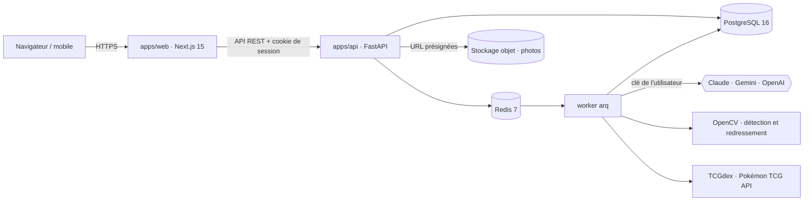
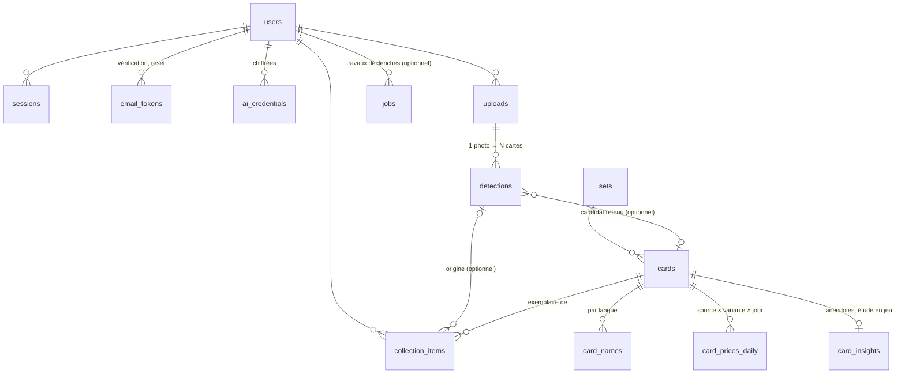

# Architecture — PokeBoyManager

> Proposition soumise à la décision **D1**. Rien n'est encore construit.

## Vue d'ensemble

| Couche | Choix | Pourquoi |
|---|---|---|
| Front | Next.js 15 (App Router), React 19, TypeScript, Tailwind 4, shadcn/ui, TanStack Query, Recharts | rendu serveur pour la page publique, écosystème de composants, courbes de valeur |
| API | FastAPI, Python 3.12, SQLAlchemy 2 async, Alembic, Pydantic v2 | la vision (OpenCV) et les SDK IA sont en Python ; même pile que les autres projets de JF |
| Jobs | arq + Redis | reconnaissance, import du catalogue, relevé des prix : tout est asynchrone et reprenable |
| Base | PostgreSQL 16 + `pg_trgm`, `unaccent` | recherche floue FR/EN, historique de prix volumineux mais simple |
| Photos | S3 (MinIO en local, Object Storage en ligne — D7) | envoi direct du navigateur, pas de fichier sur les serveurs web |
| Monorepo | pnpm workspaces + uv ; client TS généré depuis l'OpenAPI | un seul contrat entre front et back |

## Principe : la base sait, l'IA reconnaît (JF, 19/09/2026)

Tout ce qui est connu d'une carte vit dans **notre base**, peuplé dès le départ pour **toutes** les
cartes : données du catalogue (extension, numéro, rareté, attaques, talents, faiblesses,
légalités, illustrateur, images officielles) et **prix relevés chaque jour pour toutes les cartes**,
pas seulement celles possédées.

L'IA de l'utilisateur ne sert qu'à deux choses : **identifier** la carte photographiée (la
rapprocher d'une carte de la base) et **estimer son état** (propre à chaque exemplaire). Elle ne
recalcule jamais une information que la base possède :
- une photo déjà vue (même empreinte d'image) ne rappelle pas l'IA ;
- anecdotes et étude en jeu sont générées **une fois par carte** et partagées entre tous les
  utilisateurs (`card_insights`) ; la partie déterministe (légalités, attaques, règles) vient du
  catalogue sans IA ;
- **un seul appel par carte, dès le premier tir** (JF, 19/09) : à la reconnaissance, un appel rend
  ensemble l'identification et l'état ; pour le catalogue, un passage par lots (clé plateforme,
  budget plafonné) rend en une fois l'histoire et l'étude en jeu de chaque carte ;
- seule l'évolution du prix change avec le temps, et c'est le relevé quotidien qui la fournit.

## Données (v1)

- **Carte** (`cards`) = l'objet du catalogue, partagé. **Exemplaire** (`collection_items`) = ce que
  possède un utilisateur : langue, variante, état estimé, prix d'achat, photo, date d'ajout.
- `card_prices_daily` : une ligne par carte × source × variante × jour ; la courbe de valeur commence au
  premier relevé (historique rétroactif selon D3).
- `jobs` : file arq (reconnaissance, import catalogue, relevé de prix) ; `user_id` nul pour les
  travaux système (ex : relevé de prix quotidien).

Migration Alembic initiale : `apps/api/migrations/versions/5e0d551b788e_initial_schema.py`
(lot `v0-schema`). Modèles SQLAlchemy : `apps/api/src/pbm_api/models/`. Seed de démonstration
(un utilisateur, trois extensions, neuf cartes) : `apps/api/src/pbm_api/seed.py`.

## Authentification

Lot `v1-auth`. Compte e-mail + mot de passe (argon2id, 10 caractères minimum, refusé s'il
apparaît dans une fuite connue — k-anonymat HIBP). Routes : `POST /auth/{register,login,
logout,verify-email,forgot,reset}` (`apps/api/src/pbm_api/routers/auth.py`).

- **Session** : cookie `HttpOnly; Secure; SameSite=Lax`, identifiant opaque haché (SHA-256)
  en base (`sessions.token_hash`), rotation à chaque connexion (nouvelle session, l'ancienne
  reste valide — sessions multiples). Dépendance `get_current_user` (`pbm_api.auth.
  dependencies`) : à réutiliser par toute route utilisateur des lots suivants — elle ne
  dérive jamais d'un identifiant fourni par le client, uniquement du cookie.
- **CSRF** : double soumission signée (`pbm_api.security.csrf`) — cookie `pbm_csrf` = HMAC
  du jeton de session, à renvoyer dans l'en-tête `X-CSRF-Token` sur toute écriture
  authentifiée (dépendance `require_csrf`, déjà posée sur `/auth/logout`).
- **Limitation** : 5 tentatives / 15 min par compte et par IP (Redis), sur `/auth/login` et
  `/auth/forgot` (`pbm_api.security.rate_limit`).
- **E-mails** : jetons à usage unique (`email_tokens`, expirent, non réutilisables) envoyés
  via SMTP (`pbm_api.email` — Mailpit en dev, D5 provisoire pour le fournisseur en ligne).
- Anti-énumération : réponse identique côté `/auth/register` et `/auth/forgot` que l'e-mail
  soit déjà pris/connu ou non.
- **Pages** (lot `v1-pages-auth`) : `/inscription`, `/connexion`, `/mot-de-passe-oublie`,
  `/verifier?token=…`, `/reinitialiser?token=…` — les liens envoyés par e-mail pointent sur ces
  deux derniers chemins. Garde de route middleware Next.js (`apps/web/src/middleware.ts`) sur
  les pages privées (`/collection`, `/ajouter`, `/carte/*`, `/profil`) : redirection
  `/connexion?next=…` sur simple absence du cookie de session (l'API reste la seule à faire
  autorité en cas de session expirée/révoquée). `apps/api` doit exposer `CORSMiddleware` pour
  ces appels (front et API sur des origines distinctes, y compris en local).

## Catalogue (lot `v2-catalogue`)

- Source : [TCGdex](https://api.tcgdex.net) (FR + EN, sans clé) pour `sets`/`cards`/`card_names`,
  les images officielles, l'illustrateur, les attaques/talents et les légalités (déjà exposées par
  carte, pas besoin d'un second appel). `Set.tcgdex_id` / `Card.tcgdex_id` sont les clés
  d'idempotence de l'import.
- Rapprochement avec [Pokémon TCG API](https://pokemontcg.io) (`Card.ptcg_id`) : les deux
  catalogues n'utilisent pas les mêmes id d'extension (`sv03.5` vs `sv3pt5`, `hgssp` vs `hsp`...) —
  table de correspondance des cas particuliers dans
  `apps/api/src/pbm_api/catalog/reconciliation.py`, testée. Optionnel : une panne de Pokémon TCG
  API (observée flaky le 2026-09-19) dégrade l'import sans le faire échouer, `ptcg_id` reste nul.
- Job `import_catalogue` (arq, `apps/api/src/pbm_api/worker.py`) : idempotent, reprise sur erreur
  (commit par extension). Mode `full` (liste d'extensions ou tout le catalogue) et `incremental`
  (nouvelles extensions seulement, cron hebdomadaire).
- Proxy `GET /img/cards/{id}?size=high|low` (`apps/api/src/pbm_api/routers/images.py`) : sert
  l'image officielle, mise en cache dans le stockage objet (`ObjectStorage`,
  `apps/api/src/pbm_api/s3.py`) au premier accès.

## Recherche catalogue (lot `v2-recherche`)

- `GET /catalog/search?q=&set=&lang=` (`apps/api/src/pbm_api/routers/catalog.py`) : `q` est
  analysé (`pbm_api.catalog.search.parse_query`) pour distinguer un numéro (`25`, `006`,
  `236/217`, formats promo/galerie `TG05`/`GG10`/`SV107`/`XY121`) d'un nom de carte ; `set`
  (code ou nom exact d'extension) et `lang` (`fr`/`en`) filtrent strictement.
- `match_candidates` (`pbm_api.catalog.search`) est la fonction de rapprochement réutilisée par
  la reconnaissance (lot futur) : donné un nom et/ou un numéro déjà extraits, plus des indices
  optionnels d'extension (`set_hint`, bruité — pondère le score sans jamais filtrer) et de total
  de l'extension, elle renvoie les cartes candidates classées par score. Recherche de nom :
  trigram + `unaccent` sur `card_names` (extension `pg_trgm`/`unaccent`, posée par la migration
  initiale), casse et accents ignorés.
- La route essaie plusieurs découpages `<nom> <indice d'extension>` d'une requête libre (ex :
  "Pikachu VMAX Voltage Éclatant" -> nom="Pikachu VMAX", indice="Voltage Éclatant") et garde le
  meilleur score par carte — coût : jusqu'à `len(q.split())` requêtes SQL par recherche,
  acceptable au volume actuel, à revoir si la latence devient sensible.

## Coffre de clés IA

- AES-256-GCM, nonce aléatoire, `user_id` en données associées ; clé maître dans l'environnement du
  serveur, jamais en base. Rotation documentée.
- La clé n'est déchiffrée que dans le worker, au moment de l'appel. L'API ne renvoie qu'un masque
  (`sk-ant-…4f2a`). Un filtre de journalisation masque tout motif de clé ; un test échoue si une clé
  apparaît dans les logs.
- Lot `v1-byok` : routes `GET/PUT/DELETE /me/ai-keys[/{provider}]`, `POST
  /me/ai-keys/{provider}/test` (appel minimal réel au fournisseur — liste de modèles, coût nul),
  `GET/PATCH /me/ai-settings` (fournisseur/modèle par défaut, colonnes `users.ai_default_provider`/
  `ai_default_model`), `GET /me/ai-usage` (table `ai_usage_monthly` : appels, jetons, coût estimé
  par fournisseur et par mois — alimentée plus tard par le worker de reconnaissance, D4 : sans clé
  personnelle la reconnaissance reste désactivée, l'ajout manuel au catalogue reste toujours
  possible). Migration : `apps/api/migrations/versions/d42b0620077e_ai_settings_and_usage.py`.

## Fournisseurs IA (lot `v3-ia-providers`)

Interface unique `AIProvider.extract(images, schema, prompt) -> (objet validé, usage)`
(`apps/api/src/pbm_api/ai/base.py`) : changer de fournisseur ne touche aucune fonctionnalité en
aval — la reconnaissance (§ suivant) n'appelle jamais directement Anthropic/Gemini/OpenAI, elle
passe par `pbm_api.ai.factory.create_provider(provider, api_key)`.

- **Implémentations** (une par fournisseur, `apps/api/src/pbm_api/ai/`) : `AnthropicProvider`
  (`/v1/messages`, défaut `claude-sonnet-5`, économique `claude-haiku-4-5`), `OpenAiProvider`
  (`/v1/chat/completions`, défaut `gpt-4o`), `GeminiProvider` (`generateContent`, défaut
  `gemini-2.5-flash`) — modèle configurable par utilisateur (`users.ai_default_model`, lot
  `v1-byok`), en dur uniquement si l'utilisateur n'a rien choisi. Appels en HTTP direct
  (`httpx`), comme `ProviderKeyTester` (`v1-byok`) : mêmes trois fournisseurs, même raison
  (clé transmise en en-tête, jamais un SDK de plus à auditer/mettre à jour sur un lien à
  ~250 ko/s).
- **Sortie structurée native** : chaque fournisseur reçoit le schéma Pydantic de l'appelant
  traduit en JSON Schema (`pbm_api.ai.json_schema`) — `$ref`/`$defs` repliés et
  `additionalProperties: false` partout pour Anthropic/OpenAI (`output_config.format` /
  `response_format` strict) ; variante OpenAPI restreinte pour Gemini
  (`generationConfig.responseSchema`, sans `$ref`, `Optional[X]` → `{"type": "X", "nullable":
  true}`). La réponse est ensuite validée par Pydantic ; si elle ne valide pas, une seule
  nouvelle tentative est faite en expliquant l'erreur au modèle avant d'abandonner
  (`InvalidExtractionResponseError`).
- **Erreurs normalisées** (`pbm_api.ai.errors`) : `InvalidApiKeyError`, `QuotaExceededError`,
  `ProviderOverloadedError`, `ProviderUnreachableError`, `ContentRefusedError` — chacune porte un
  `user_message` prêt à afficher et à consigner sur le `Job` (mission point 3). La
  correspondance code HTTP → erreur est commune à Anthropic/OpenAI
  (`pbm_api.ai.http_errors`) ; Gemini a la sienne (`gemini_provider._raise_for_gemini_error`) car
  un 400 y couvre aussi bien une clé invalide qu'une requête malformée — distingués par
  `error.status` du corps JSON, pas par le seul code HTTP.
- **Photos** : `pbm_api.ai.images.detect_media_type` sniffe le type MIME depuis les octets
  (JPEG/PNG/WebP), jamais supposé depuis l'extension du fichier.
- **Sans clé réelle sur chimera** : suite automatisée sur réponses enregistrées
  (`apps/api/tests/test_ai_providers.py`, `httpx.MockTransport`) ; essai manuel avec une vraie
  clé : `uv run python scripts/test_ai_extraction_manual.py <provider> <clé>` depuis
  `apps/api`.

## Reconnaissance

1. **Détection** : contours OpenCV + ratio 63×88 mm, redressement perspective ; repli par boîtes
   englobantes demandées au LLM quand la photo est difficile (pochettes, reflets, fond clair).
2. **Extraction** par carte : nom, numéro (`236/217`, `XY121`, `TG05`), code d'extension, langue, PV,
   variante — sortie structurée validée par schéma, via `AIProvider.extract` (§ précédent, lot
   `v3-ia-providers`) avec la clé de l'utilisateur.
3. **Rapprochement** avec le catalogue : numéro + extension, puis numéro + nom, puis recherche floue ;
   top 3 avec score.
4. **Validation humaine** obligatoire ; chaque correction alimente le jeu de régression.
5. **État** indicatif (centrage mesuré, coins, bords, surface) et drapeau « contrefaçon probable ».

## Anecdotes sourcées (lot `v4-anecdotes`)

- `GET /cards/{card_id}/insights` (`apps/api/src/pbm_api/routers/card_insights.py`) : trois à
  cinq anecdotes courtes, chacune avec `source_url`. Cache partagé `card_insights` (une ligne
  par carte, posée dès `v0-schema`) : générées **une seule fois**, avec la clé IA de
  l'utilisateur qui ouvre la fiche la première fois (D4 : sans clé par défaut,
  `status: "no_ai_key"`, jamais d'appel) — tout utilisateur suivant lit le cache, sans clé.
- Contexte (`pbm_api.insights.context`) : API MediaWiki publique de deux domaines fixes,
  `www.pokepedia.fr` et `bulbapedia.bulbagarden.net` — recherche puis extrait texte brut, jamais
  une URL fournie par le client. Résilient à un wiki muet ou en panne (`fetch_page` ne lève
  jamais).
- Génération (`pbm_api.insights.generation`) : `AIProvider.extract` (fournisseur de
  l'utilisateur, `v3-ia-providers`) sur un prompt qui liste les pages et leurs URLs ; toute
  anecdote dont `source_url` ne figure pas dans le contexte réellement récupéré est rejetée après
  coup (`pbm_api.insights.service`), même si le modèle a ignoré la consigne — défense en
  profondeur contre l'hallucination.
- `POST /cards/{card_id}/insights/report` (table `card_insight_reports`) : bouton « Signaler une
  erreur », un signalement par utilisateur et par carte.
- Verrou consultatif Postgres (`pg_advisory_xact_lock`) : deux requêtes concurrentes sur une
  carte jamais vue ne déclenchent qu'un seul appel IA. Cache positif 180 jours (une anecdote
  sourcée ne se périme pas), négatif 1 jour (une carte sans contexte aujourd'hui peut en trouver
  un demain — jamais un échec permanent silencieux).
- `in_game_study` (étude en jeu, même table `card_insights`) : hors périmètre de ce lot, laissé
  `NULL`.

## Prix (lot `v2-prix`)

- Job `daily_prices_task` (arq, cron quotidien 06:00, `apps/api/src/pbm_api/worker.py`) : une
  ligne `card_prices_daily` par carte × source × variante × jour, idempotente (upsert sur la
  contrainte unique). Cardmarket via `TcgdexClient.get_card` (`pricing.cardmarket`, EUR) ;
  TCGplayer via `PtcgClient.list_cards_in_set` groupé par extension déduite de `ptcg_id`
  (`tcgplayer.prices.<variante>`, USD). Extraction : `pbm_api/pricing/extract.py`. Reprise sur
  erreur à la carte/au set près, comme l'import catalogue.
- Job `daily_exchange_rates_task` (même cron) : flux quotidien BCE
  (`eurofxref-daily.xml`) → `exchange_rates_daily` (`pbm_api/pricing/exchange_rates.py`).
  `get_rate_to_eur` retombe sur le taux le plus récent connu à une date donnée (pas de
  publication le week-end), jamais une extrapolation.
- Sonde (mission point 4) : `EmptyPriceRunError` si aucun prix n'a pu être écrit alors que le
  catalogue contient des cartes → le `Job` correspondant passe `failed` avec l'erreur en clair,
  jamais un succès silencieux. Pas d'alerting externe dans ce lot (aucune infra dédiée) : la
  table `jobs` est le canal, à brancher sur une notification par un lot ultérieur.
- Service `valuation` (`pbm_api/pricing/valuation.py`) : `reference_price_eur` = tendance
  Cardmarket, sinon tendance TCGplayer convertie en EUR au taux BCE ; une tendance sans plafond
  de bon sens (marché fin) est écrêtée à 3× le prix moyen du même relevé (risque documenté :
  « ne doit pas faire exploser la valeur d'une collection »). `item_value`/`collection_value`
  appliquent une décote par état (barème M/NM/EX/GD/LP/PL/PO, `CONDITION_MULTIPLIERS`) et
  convertissent dans la devise demandée (`users.preferred_currency`, colonne du lot). Pas de
  route HTTP dans ce lot (back-end seul, testé au niveau service) : `collection_value` filtre
  toujours par `user_id` reçu en paramètre.

## Classement (lot `v4-ranking`)

D6 : les trois classements affichés sur la fiche carte — rang de rareté, rang de valeur dans la
collection personnelle, percentile de valeur dans l'extension.

- Vue matérialisée `card_value_rank` (migration `11f10f8c0f40`, une ligne par carte du
  catalogue) : `reference_price_eur` (tendance Cardmarket la plus récente, sinon tendance
  TCGplayer convertie en EUR au taux le plus récent connu — approximation assumée pour un
  agrégat périodique, contrairement à `pricing.valuation.reference_price_eur` qui aligne prix et
  taux au jour près pour la valeur d'un exemplaire ; écrêtage des tendances aberrantes identique
  à `_sanitize_trend`, maximum entre variantes), `value_percentile` (`PERCENT_RANK()` partitionné
  par `set_id` — 0..1, 0 pour une partition à une seule carte tarifée), `rarity_rank`/
  `rarity_group_size` (`DENSE_RANK()` croissant sur la taille du groupe de cartes partageant la
  même valeur de `cards.rarity` au sein de l'extension : moins de cartes de cette rareté = rang 1
  = plus rare — dérivé uniquement du catalogue, aucune échelle de rareté externe).
- Rafraîchie par `pbm_api.ranking.service.refresh_card_value_rank` (`REFRESH MATERIALIZED VIEW`
  simple, pas `CONCURRENTLY` — verrou exclusif bref accepté pour un job quotidien à faible trafic
  concurrent ; un index unique sur `card_id` est déjà posé pour basculer vers `CONCURRENTLY` plus
  tard sans nouvelle migration), appelée depuis `worker._run_daily_prices` juste après un relevé
  de prix réussi — jamais sur un relevé vide ou en échec.
- Rang de valeur dans la collection (`pbm_api.ranking.service.collection_rank`) : calculé à la
  demande (pas de vue, collection personnelle bien plus petite que le catalogue entier), classe
  les exemplaires d'un utilisateur par `item_value` décroissant (`RANK` SQL standard — égalité de
  valeur = même rang, le suivant saute d'autant) ; un exemplaire sans prix connu n'est pas classé.
- `GET /me/collection/{item}` (`pbm_api/routers/collection.py`) expose les trois classements sur
  un exemplaire. Première route de collection posée dans le dépôt (aucun lot fusionné avant
  celui-ci ne l'avait créée) : volontairement réduite aux champs nécessaires à ce lot —
  `v4-collection` (liste, filtres, `PATCH`/`DELETE`) et `v4-fiche` (données de catalogue
  enrichies) l'étendent sans revenir sur ce qui précède.

## Environnements

| | Où | Comment |
|---|---|---|
| Local | chaque machine de la flotte | `docker compose up` (Postgres, Redis, MinIO, Mailpit) |
| CI | GitHub Actions | lint, tests, e2e Playwright |
| UAT / PROD | selon D2 | images construites sur chimera, déployées par devAI (`pull` + `up -d`) |
