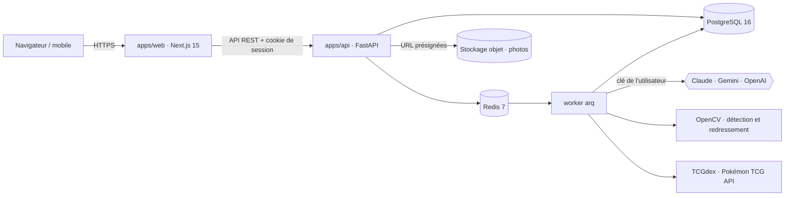
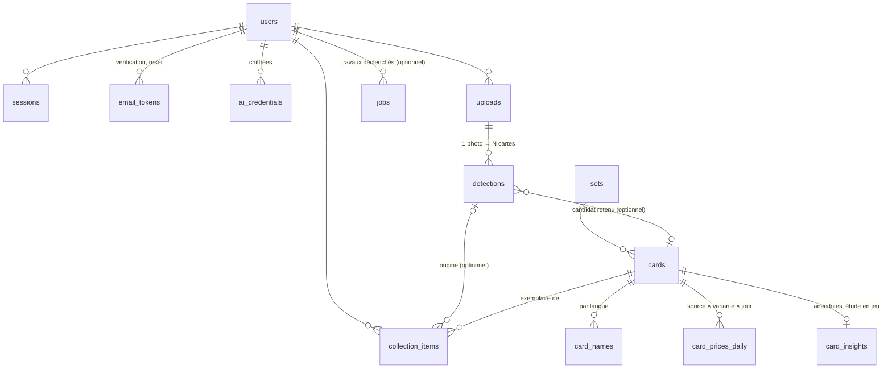

# Architecture — PokeBoyManager

> Proposition soumise à la décision **D1**. Rien n'est encore construit.

## Vue d'ensemble

| Couche | Choix | Pourquoi |
|---|---|---|
| Front | Next.js 15 (App Router), React 19, TypeScript, Tailwind 4, shadcn/ui, TanStack Query, Recharts | rendu serveur pour la page publique, écosystème de composants, courbes de valeur |
| API | FastAPI, Python 3.12, SQLAlchemy 2 async, Alembic, Pydantic v2 | la vision (OpenCV) et les SDK IA sont en Python ; même pile que les autres projets de JF |
| Jobs | arq + Redis | reconnaissance, import du catalogue, relevé des prix : tout est asynchrone et reprenable |
| Base | PostgreSQL 16 + `pg_trgm`, `unaccent` | recherche floue FR/EN, historique de prix volumineux mais simple |
| Photos | S3 (MinIO en local, Object Storage en ligne — D7) | envoi direct du navigateur, pas de fichier sur les serveurs web |
| Monorepo | pnpm workspaces + uv ; client TS généré depuis l'OpenAPI | un seul contrat entre front et back |

## Données (v1)

- **Carte** (`cards`) = l'objet du catalogue, partagé. **Exemplaire** (`collection_items`) = ce que
  possède un utilisateur : langue, variante, état estimé, prix d'achat, photo, date d'ajout.
- `card_prices_daily` : une ligne par carte × source × variante × jour ; la courbe de valeur commence au
  premier relevé (historique rétroactif selon D3).
- `jobs` : file arq (reconnaissance, import catalogue, relevé de prix) ; `user_id` nul pour les
  travaux système (ex : relevé de prix quotidien).

Migration Alembic initiale : `apps/api/migrations/versions/5e0d551b788e_initial_schema.py`
(lot `v0-schema`). Modèles SQLAlchemy : `apps/api/src/pbm_api/models/`. Seed de démonstration
(un utilisateur, trois extensions, neuf cartes) : `apps/api/src/pbm_api/seed.py`.

## Coffre de clés IA

- AES-256-GCM, nonce aléatoire, `user_id` en données associées ; clé maître dans l'environnement du
  serveur, jamais en base. Rotation documentée.
- La clé n'est déchiffrée que dans le worker, au moment de l'appel. L'API ne renvoie qu'un masque
  (`sk-ant-…4f2a`). Un filtre de journalisation masque tout motif de clé ; un test échoue si une clé
  apparaît dans les logs.

## Reconnaissance

1. **Détection** : contours OpenCV + ratio 63×88 mm, redressement perspective ; repli par boîtes
   englobantes demandées au LLM quand la photo est difficile (pochettes, reflets, fond clair).
2. **Extraction** par carte : nom, numéro (`236/217`, `XY121`, `TG05`), code d'extension, langue, PV,
   variante — sortie structurée validée par schéma.
3. **Rapprochement** avec le catalogue : numéro + extension, puis numéro + nom, puis recherche floue ;
   top 3 avec score.
4. **Validation humaine** obligatoire ; chaque correction alimente le jeu de régression.
5. **État** indicatif (centrage mesuré, coins, bords, surface) et drapeau « contrefaçon probable ».

## Prix

Relevé quotidien 06:00 Europe/Paris : Cardmarket (EUR, via TCGdex) et TCGplayer (USD, via Pokémon TCG
API), taux BCE. Valeur de référence = tendance Cardmarket ; décote par état documentée. Un relevé vide
déclenche une alerte.

## Environnements

| | Où | Comment |
|---|---|---|
| Local | chaque machine de la flotte | `docker compose up` (Postgres, Redis, MinIO, Mailpit) |
| CI | GitHub Actions | lint, tests, e2e Playwright |
| UAT / PROD | selon D2 | images construites sur chimera, déployées par devAI (`pull` + `up -d`) |
